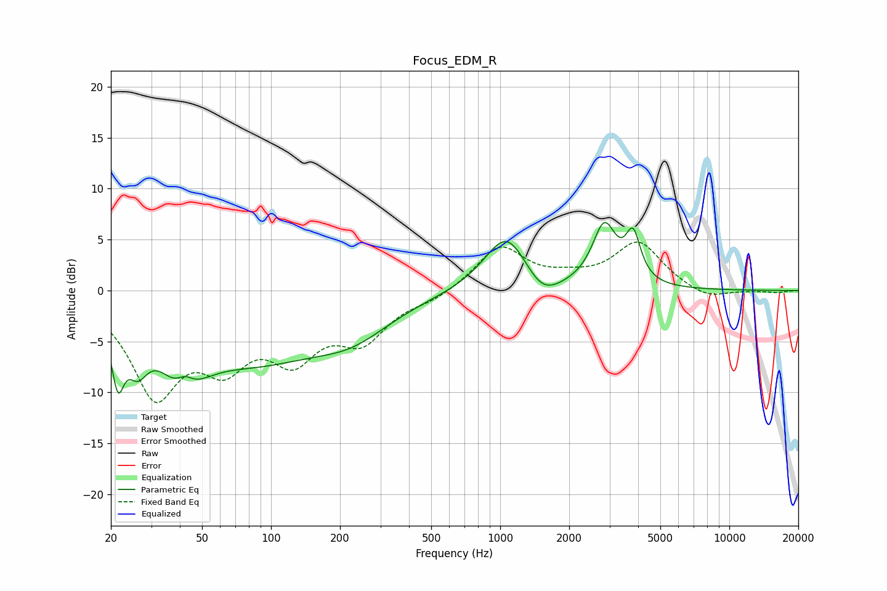

# Focus_EDM_R
See [usage instructions](https://github.com/jaakkopasanen/AutoEq#usage) for more options and info.

### Parametric EQs
Apply preamp of -6.8 dB when using parametric equalizer.

|   # | Type    |   Fc (Hz) |    Q |   Gain (dB) |
|-----|---------|-----------|------|-------------|
|   1 | Peaking |        21 | 5.18 |        -5.9 |
|   2 | Peaking |        26 | 3.2  |        -3.7 |
|   3 | Peaking |        41 | 1.84 |        -8.4 |
|   4 | Peaking |        42 | 2.89 |         4.8 |
|   5 | Peaking |        84 | 0.44 |        -6.2 |
|   6 | Peaking |       227 | 0.83 |        -2.6 |
|   7 | Peaking |      1068 | 1.45 |         5.8 |
|   8 | Peaking |      1520 | 1.83 |        -2.3 |
|   9 | Peaking |      2848 | 2.72 |         6   |
|  10 | Peaking |      3803 | 4.41 |         4.4 |

### Fixed Band EQs
When using fixed band (also called graphic) equalizer, apply preamp of **-4.9 dB** (if available) and set gains manually with these parameters.

|   # | Type    |   Fc (Hz) |    Q |   Gain (dB) |
|-----|---------|-----------|------|-------------|
|   1 | Peaking |        31 | 1.41 |        -9.7 |
|   2 | Peaking |        62 | 1.41 |        -5.7 |
|   3 | Peaking |       125 | 1.41 |        -5.6 |
|   4 | Peaking |       250 | 1.41 |        -4.3 |
|   5 | Peaking |       500 | 1.41 |        -0.8 |
|   6 | Peaking |      1000 | 1.41 |         4.3 |
|   7 | Peaking |      2000 | 1.41 |         0.8 |
|   8 | Peaking |      4000 | 1.41 |         4.6 |
|   9 | Peaking |      8000 | 1.41 |        -1   |
|  10 | Peaking |     16000 | 1.41 |        -0.2 |

### Graphs

