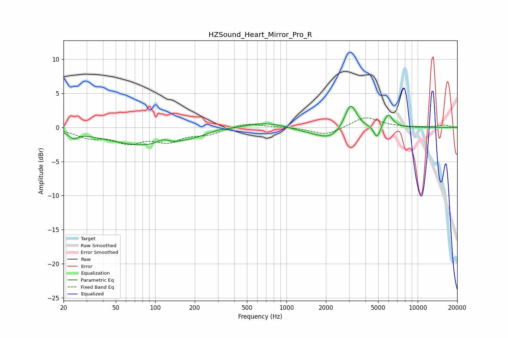

# HZSound_Heart_Mirror_Pro_R
See [usage instructions](https://github.com/jaakkopasanen/AutoEq#usage) for more options and info.

### Parametric EQs
Apply preamp of -3.2 dB when using parametric equalizer.

|   # | Type    |   Fc (Hz) |    Q |   Gain (dB) |
|-----|---------|-----------|------|-------------|
|   1 | Peaking |        24 | 4.7  |        -0.9 |
|   2 | Peaking |        91 | 0.43 |        -2.7 |
|   3 | Peaking |       114 | 3.02 |         0.8 |
|   4 | Peaking |       303 | 2.07 |         0.4 |
|   5 | Peaking |       673 | 0.84 |         1   |
|   6 | Peaking |      1470 | 1.01 |        -0.5 |
|   7 | Peaking |      2167 | 1.43 |        -1.5 |
|   8 | Peaking |      3082 | 3.11 |         3.9 |
|   9 | Peaking |      4902 | 5.98 |        -1.9 |
|  10 | Peaking |      5965 | 4.12 |         2   |

### Fixed Band EQs
When using fixed band (also called graphic) equalizer, apply preamp of **-1.5 dB** (if available) and set gains manually with these parameters.

|   # | Type    |   Fc (Hz) |    Q |   Gain (dB) |
|-----|---------|-----------|------|-------------|
|   1 | Peaking |        31 | 1.41 |        -1.3 |
|   2 | Peaking |        62 | 1.41 |        -2   |
|   3 | Peaking |       125 | 1.41 |        -1.8 |
|   4 | Peaking |       250 | 1.41 |        -0.9 |
|   5 | Peaking |       500 | 1.41 |         0.7 |
|   6 | Peaking |      1000 | 1.41 |         0.1 |
|   7 | Peaking |      2000 | 1.41 |        -1.2 |
|   8 | Peaking |      4000 | 1.41 |         1.6 |
|   9 | Peaking |      8000 | 1.41 |         0   |
|  10 | Peaking |     16000 | 1.41 |         0.3 |

### Graphs

