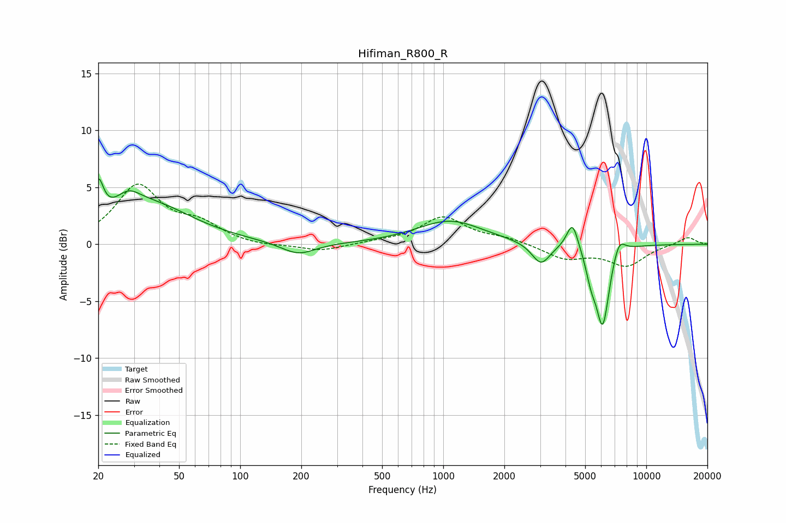

# Hifiman_R800_R
See [usage instructions](https://github.com/jaakkopasanen/AutoEq#usage) for more options and info.

### Parametric EQs
Apply preamp of -5.8 dB when using parametric equalizer.

|   # | Type    |   Fc (Hz) |    Q |   Gain (dB) |
|-----|---------|-----------|------|-------------|
|   1 | Peaking |        20 | 5.72 |         3.3 |
|   2 | Peaking |        28 | 2.39 |         1.4 |
|   3 | Peaking |        36 | 0.66 |         3.4 |
|   4 | Peaking |       193 | 1.67 |        -1.1 |
|   5 | Peaking |      1077 | 0.88 |         2.1 |
|   6 | Peaking |      3028 | 3.14 |        -1.9 |
|   7 | Peaking |      4332 | 4.92 |         2.5 |
|   8 | Peaking |      5354 | 5.3  |        -1.9 |
|   9 | Peaking |      6102 | 4.2  |        -7   |
|  10 | Peaking |      7339 | 4.46 |         1.5 |

### Fixed Band EQs
When using fixed band (also called graphic) equalizer, apply preamp of **-5.4 dB** (if available) and set gains manually with these parameters.

|   # | Type    |   Fc (Hz) |    Q |   Gain (dB) |
|-----|---------|-----------|------|-------------|
|   1 | Peaking |        31 | 1.41 |         5   |
|   2 | Peaking |        62 | 1.41 |         1.5 |
|   3 | Peaking |       125 | 1.41 |        -0.2 |
|   4 | Peaking |       250 | 1.41 |        -0.6 |
|   5 | Peaking |       500 | 1.41 |         0.2 |
|   6 | Peaking |      1000 | 1.41 |         2.3 |
|   7 | Peaking |      2000 | 1.41 |         0.5 |
|   8 | Peaking |      4000 | 1.41 |        -1.2 |
|   9 | Peaking |      8000 | 1.41 |        -1.8 |
|  10 | Peaking |     16000 | 1.41 |         0.7 |

### Graphs

