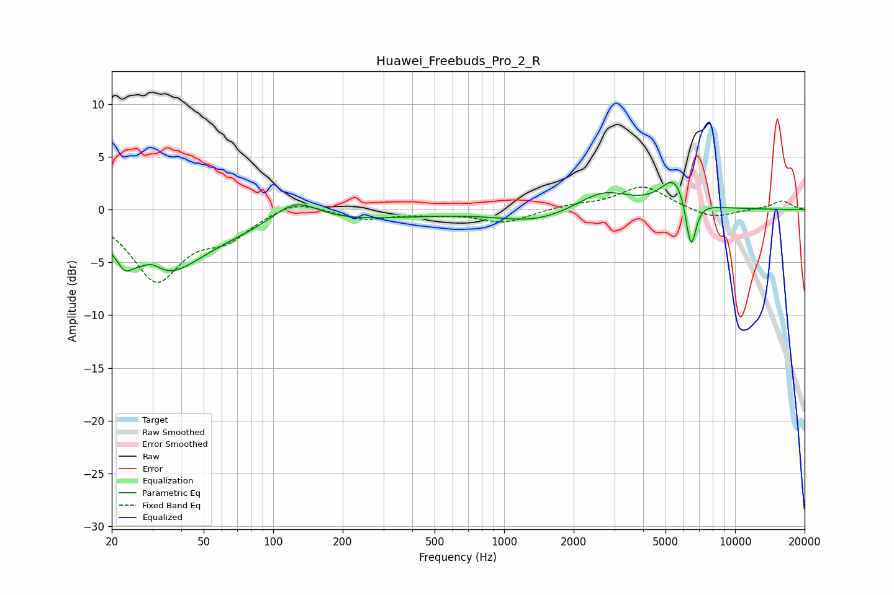

# Huawei_Freebuds_Pro_2_R
See [usage instructions](https://github.com/jaakkopasanen/AutoEq#usage) for more options and info.

### Parametric EQs
Apply preamp of -2.7 dB when using parametric equalizer.

|   # | Type    |   Fc (Hz) |    Q |   Gain (dB) |
|-----|---------|-----------|------|-------------|
|   1 | Peaking |        23 | 5.05 |        -1.2 |
|   2 | Peaking |        30 | 2.97 |         1.4 |
|   3 | Peaking |        31 | 0.84 |        -5.6 |
|   4 | Peaking |        56 | 0.46 |        -1.2 |
|   5 | Peaking |       125 | 1.42 |         2.3 |
|   6 | Peaking |       210 | 0.44 |        -0.8 |
|   7 | Peaking |      1368 | 0.87 |        -1.2 |
|   8 | Peaking |      2686 | 1.25 |         1.9 |
|   9 | Peaking |      5498 | 2.35 |         3   |
|  10 | Peaking |      6439 | 5.99 |        -5   |

### Fixed Band EQs
When using fixed band (also called graphic) equalizer, apply preamp of **-2.2 dB** (if available) and set gains manually with these parameters.

|   # | Type    |   Fc (Hz) |    Q |   Gain (dB) |
|-----|---------|-----------|------|-------------|
|   1 | Peaking |        31 | 1.41 |        -6.5 |
|   2 | Peaking |        62 | 1.41 |        -2.3 |
|   3 | Peaking |       125 | 1.41 |         1.1 |
|   4 | Peaking |       250 | 1.41 |        -0.9 |
|   5 | Peaking |       500 | 1.41 |        -0.3 |
|   6 | Peaking |      1000 | 1.41 |        -1.2 |
|   7 | Peaking |      2000 | 1.41 |         0.4 |
|   8 | Peaking |      4000 | 1.41 |         2.2 |
|   9 | Peaking |      8000 | 1.41 |        -0.9 |
|  10 | Peaking |     16000 | 1.41 |         0.8 |

### Graphs

