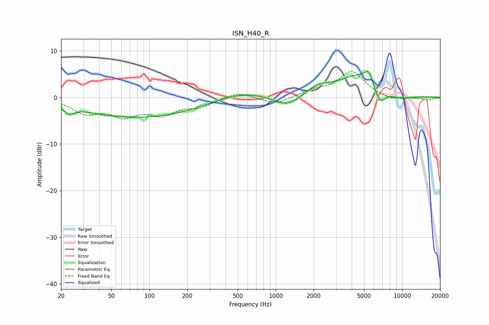

# ISN_H40_R
See [usage instructions](https://github.com/jaakkopasanen/AutoEq#usage) for more options and info.

### Parametric EQs
Apply preamp of -5.7 dB when using parametric equalizer.

|   # | Type    |   Fc (Hz) |    Q |   Gain (dB) |
|-----|---------|-----------|------|-------------|
|   1 | Peaking |        23 | 3.57 |        -1.6 |
|   2 | Peaking |        39 | 0.76 |        -0.3 |
|   3 | Peaking |        91 | 0.31 |        -4.2 |
|   4 | Peaking |       528 | 0.65 |         1.7 |
|   5 | Peaking |      1228 | 1.34 |        -2.6 |
|   6 | Peaking |      2143 | 1.45 |         1.6 |
|   7 | Peaking |      4953 | 0.73 |         5.3 |
|   8 | Peaking |      5467 | 4.52 |         2.3 |
|   9 | Peaking |      6661 | 2.61 |        -4.4 |
|  10 | Peaking |      9548 | 1.23 |        -1.6 |

### Fixed Band EQs
When using fixed band (also called graphic) equalizer, apply preamp of **-5.7 dB** (if available) and set gains manually with these parameters.

|   # | Type    |   Fc (Hz) |    Q |   Gain (dB) |
|-----|---------|-----------|------|-------------|
|   1 | Peaking |        31 | 1.41 |        -3.1 |
|   2 | Peaking |        62 | 1.41 |        -3.4 |
|   3 | Peaking |       125 | 1.41 |        -3.2 |
|   4 | Peaking |       250 | 1.41 |        -1.8 |
|   5 | Peaking |       500 | 1.41 |         1.3 |
|   6 | Peaking |      1000 | 1.41 |        -1.5 |
|   7 | Peaking |      2000 | 1.41 |         1.3 |
|   8 | Peaking |      4000 | 1.41 |         5.5 |
|   9 | Peaking |      8000 | 1.41 |        -0.7 |
|  10 | Peaking |     16000 | 1.41 |        -0.6 |

### Graphs

