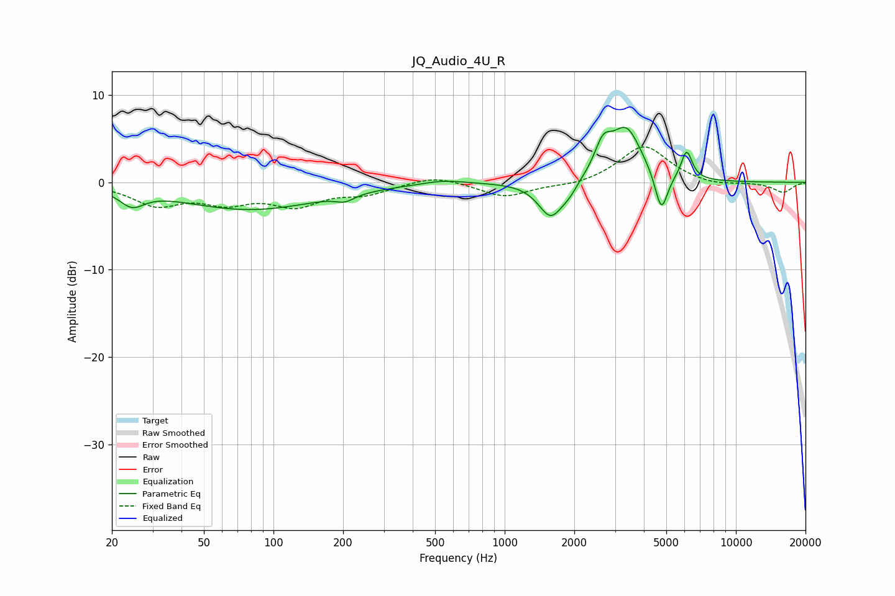

# JQ_Audio_4U_R
See [usage instructions](https://github.com/jaakkopasanen/AutoEq#usage) for more options and info.

### Parametric EQs
Apply preamp of -6.4 dB when using parametric equalizer.

|   # | Type    |   Fc (Hz) |    Q |   Gain (dB) |
|-----|---------|-----------|------|-------------|
|   1 | Peaking |        24 | 2.71 |        -1.8 |
|   2 | Peaking |        79 | 0.46 |        -3.1 |
|   3 | Peaking |       204 | 3.51 |        -0.7 |
|   4 | Peaking |       541 | 1.54 |         0.5 |
|   5 | Peaking |      1584 | 2.61 |        -4.1 |
|   6 | Peaking |      1903 | 4.03 |        -0.9 |
|   7 | Peaking |      2661 | 3.83 |         3.1 |
|   8 | Peaking |      3356 | 2.09 |         6   |
|   9 | Peaking |      4758 | 5.06 |        -4.7 |
|  10 | Peaking |      6122 | 5.82 |         3.3 |

### Fixed Band EQs
When using fixed band (also called graphic) equalizer, apply preamp of **-4.2 dB** (if available) and set gains manually with these parameters.

|   # | Type    |   Fc (Hz) |    Q |   Gain (dB) |
|-----|---------|-----------|------|-------------|
|   1 | Peaking |        31 | 1.41 |        -2.4 |
|   2 | Peaking |        62 | 1.41 |        -1.9 |
|   3 | Peaking |       125 | 1.41 |        -2.4 |
|   4 | Peaking |       250 | 1.41 |        -1.2 |
|   5 | Peaking |       500 | 1.41 |         0.9 |
|   6 | Peaking |      1000 | 1.41 |        -1.7 |
|   7 | Peaking |      2000 | 1.41 |        -0.4 |
|   8 | Peaking |      4000 | 1.41 |         4.3 |
|   9 | Peaking |      8000 | 1.41 |        -0.4 |
|  10 | Peaking |     16000 | 1.41 |        -1.2 |

### Graphs

