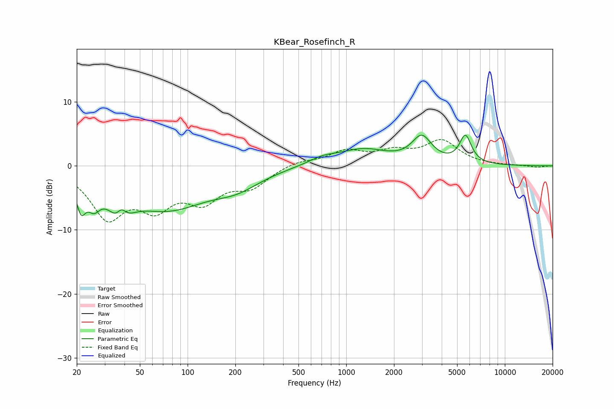

# KBear_Rosefinch_R
See [usage instructions](https://github.com/jaakkopasanen/AutoEq#usage) for more options and info.

### Parametric EQs
Apply preamp of -4.9 dB when using parametric equalizer.

|   # | Type    |   Fc (Hz) |    Q |   Gain (dB) |
|-----|---------|-----------|------|-------------|
|   1 | Peaking |        21 | 4.88 |        -4.3 |
|   2 | Peaking |        26 | 3.49 |        -3.1 |
|   3 | Peaking |        38 | 2.43 |        -6.9 |
|   4 | Peaking |        38 | 4.02 |         4.4 |
|   5 | Peaking |        74 | 0.54 |        -6.3 |
|   6 | Peaking |       206 | 0.97 |        -2.1 |
|   7 | Peaking |       708 | 1.56 |         1   |
|   8 | Peaking |      1284 | 0.91 |         2.4 |
|   9 | Peaking |      2995 | 2.27 |         4   |
|  10 | Peaking |      5641 | 3.72 |         4.3 |

### Fixed Band EQs
When using fixed band (also called graphic) equalizer, apply preamp of **-4.2 dB** (if available) and set gains manually with these parameters.

|   # | Type    |   Fc (Hz) |    Q |   Gain (dB) |
|-----|---------|-----------|------|-------------|
|   1 | Peaking |        31 | 1.41 |        -7.5 |
|   2 | Peaking |        62 | 1.41 |        -5.4 |
|   3 | Peaking |       125 | 1.41 |        -4.7 |
|   4 | Peaking |       250 | 1.41 |        -2.9 |
|   5 | Peaking |       500 | 1.41 |         0.8 |
|   6 | Peaking |      1000 | 1.41 |         2.1 |
|   7 | Peaking |      2000 | 1.41 |         1.8 |
|   8 | Peaking |      4000 | 1.41 |         3.7 |
|   9 | Peaking |      8000 | 1.41 |         0   |
|  10 | Peaking |     16000 | 1.41 |        -0.2 |

### Graphs

