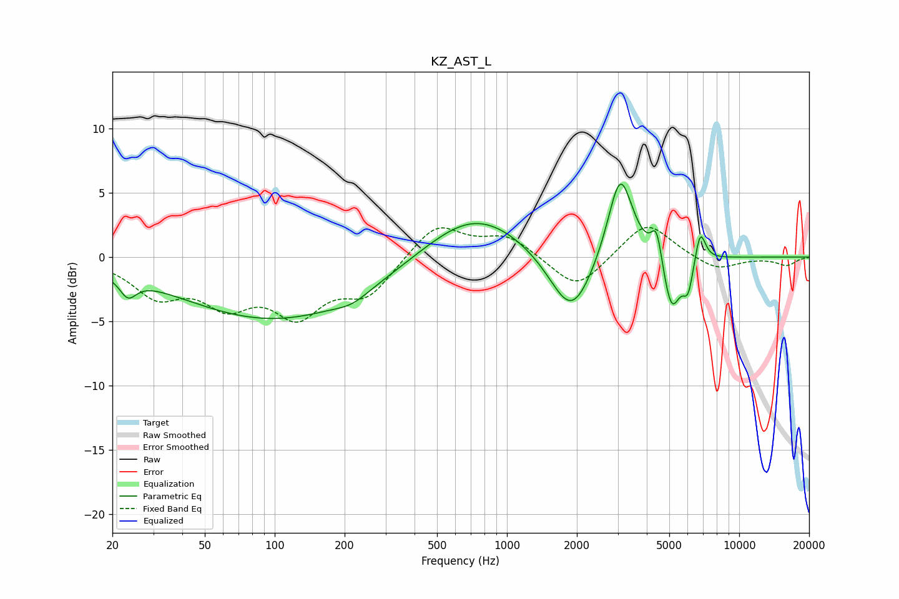

# KZ_AST_L
See [usage instructions](https://github.com/jaakkopasanen/AutoEq#usage) for more options and info.

### Parametric EQs
Apply preamp of -5.8 dB when using parametric equalizer.

|   # | Type    |   Fc (Hz) |    Q |   Gain (dB) |
|-----|---------|-----------|------|-------------|
|   1 | Peaking |        23 | 3.96 |        -1.5 |
|   2 | Peaking |       102 | 0.33 |        -4.9 |
|   3 | Peaking |       216 | 2.03 |        -0.6 |
|   4 | Peaking |       723 | 0.66 |         3.8 |
|   5 | Peaking |      1898 | 1.48 |        -5.3 |
|   6 | Peaking |      3073 | 2.58 |         7   |
|   7 | Peaking |      4412 | 6    |         2.7 |
|   8 | Peaking |      5112 | 3.68 |        -4.4 |
|   9 | Peaking |      6028 | 5.99 |        -2.4 |
|  10 | Peaking |      6792 | 6    |         2.6 |

### Fixed Band EQs
When using fixed band (also called graphic) equalizer, apply preamp of **-2.4 dB** (if available) and set gains manually with these parameters.

|   # | Type    |   Fc (Hz) |    Q |   Gain (dB) |
|-----|---------|-----------|------|-------------|
|   1 | Peaking |        31 | 1.41 |        -2.7 |
|   2 | Peaking |        62 | 1.41 |        -3.1 |
|   3 | Peaking |       125 | 1.41 |        -4   |
|   4 | Peaking |       250 | 1.41 |        -2.8 |
|   5 | Peaking |       500 | 1.41 |         2.7 |
|   6 | Peaking |      1000 | 1.41 |         1.6 |
|   7 | Peaking |      2000 | 1.41 |        -2.7 |
|   8 | Peaking |      4000 | 1.41 |         2.9 |
|   9 | Peaking |      8000 | 1.41 |        -1.1 |
|  10 | Peaking |     16000 | 1.41 |        -0.6 |

### Graphs

