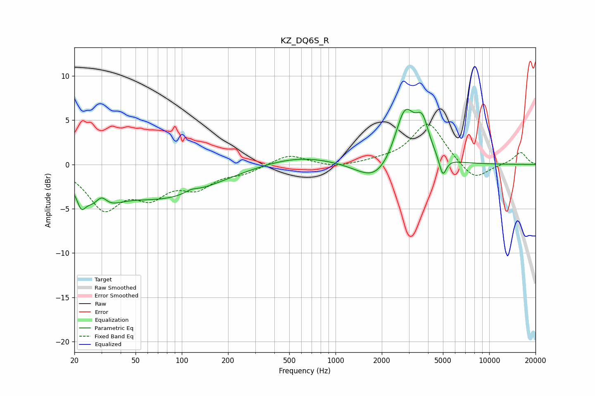

# KZ_DQ6S_R
See [usage instructions](https://github.com/jaakkopasanen/AutoEq#usage) for more options and info.

### Parametric EQs
Apply preamp of -6.3 dB when using parametric equalizer.

|   # | Type    |   Fc (Hz) |    Q |   Gain (dB) |
|-----|---------|-----------|------|-------------|
|   1 | Peaking |        22 | 5.35 |        -1.8 |
|   2 | Peaking |        29 | 1.44 |        -3.7 |
|   3 | Peaking |        30 | 3.47 |         2   |
|   4 | Peaking |        76 | 0.42 |        -3.6 |
|   5 | Peaking |       115 | 3.48 |         0.4 |
|   6 | Peaking |       582 | 0.58 |         1   |
|   7 | Peaking |      1840 | 1.16 |        -2.5 |
|   8 | Peaking |      2825 | 2.11 |         6.4 |
|   9 | Peaking |      3676 | 3.31 |         3.6 |
|  10 | Peaking |      4984 | 6    |        -2.2 |

### Fixed Band EQs
When using fixed band (also called graphic) equalizer, apply preamp of **-4.6 dB** (if available) and set gains manually with these parameters.

|   # | Type    |   Fc (Hz) |    Q |   Gain (dB) |
|-----|---------|-----------|------|-------------|
|   1 | Peaking |        31 | 1.41 |        -4.7 |
|   2 | Peaking |        62 | 1.41 |        -3   |
|   3 | Peaking |       125 | 1.41 |        -2.2 |
|   4 | Peaking |       250 | 1.41 |        -0.8 |
|   5 | Peaking |       500 | 1.41 |         1.2 |
|   6 | Peaking |      1000 | 1.41 |        -0.4 |
|   7 | Peaking |      2000 | 1.41 |         0.3 |
|   8 | Peaking |      4000 | 1.41 |         4.8 |
|   9 | Peaking |      8000 | 1.41 |        -2   |
|  10 | Peaking |     16000 | 1.41 |         1.4 |

### Graphs

