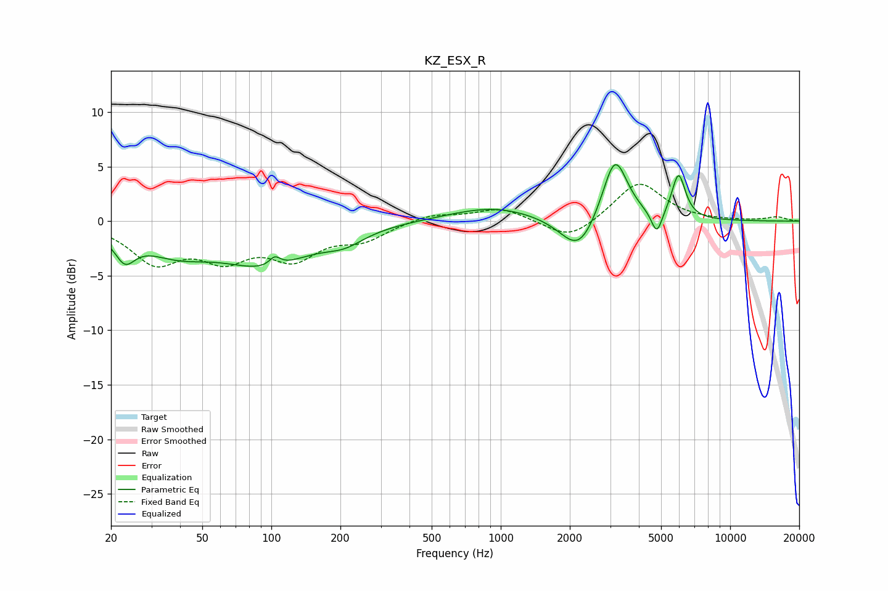

# KZ_ESX_R
See [usage instructions](https://github.com/jaakkopasanen/AutoEq#usage) for more options and info.

### Parametric EQs
Apply preamp of -5.3 dB when using parametric equalizer.

|   # | Type    |   Fc (Hz) |    Q |   Gain (dB) |
|-----|---------|-----------|------|-------------|
|   1 | Peaking |        23 | 3.15 |        -2.4 |
|   2 | Peaking |        38 | 0.93 |        -2.2 |
|   3 | Peaking |        95 | 0.71 |        -3.6 |
|   4 | Peaking |       104 | 5.97 |         0.9 |
|   5 | Peaking |       208 | 1.63 |        -1.1 |
|   6 | Peaking |       930 | 0.74 |         1.3 |
|   7 | Peaking |      2190 | 1.78 |        -3.4 |
|   8 | Peaking |      3145 | 2.55 |         6.2 |
|   9 | Peaking |      4790 | 5.92 |        -2.2 |
|  10 | Peaking |      5957 | 4.68 |         4.1 |

### Fixed Band EQs
When using fixed band (also called graphic) equalizer, apply preamp of **-3.5 dB** (if available) and set gains manually with these parameters.

|   # | Type    |   Fc (Hz) |    Q |   Gain (dB) |
|-----|---------|-----------|------|-------------|
|   1 | Peaking |        31 | 1.41 |        -3.5 |
|   2 | Peaking |        62 | 1.41 |        -2.9 |
|   3 | Peaking |       125 | 1.41 |        -3   |
|   4 | Peaking |       250 | 1.41 |        -1.5 |
|   5 | Peaking |       500 | 1.41 |         0.7 |
|   6 | Peaking |      1000 | 1.41 |         1.2 |
|   7 | Peaking |      2000 | 1.41 |        -1.8 |
|   8 | Peaking |      4000 | 1.41 |         3.7 |
|   9 | Peaking |      8000 | 1.41 |         0   |
|  10 | Peaking |     16000 | 1.41 |         0.4 |

### Graphs

