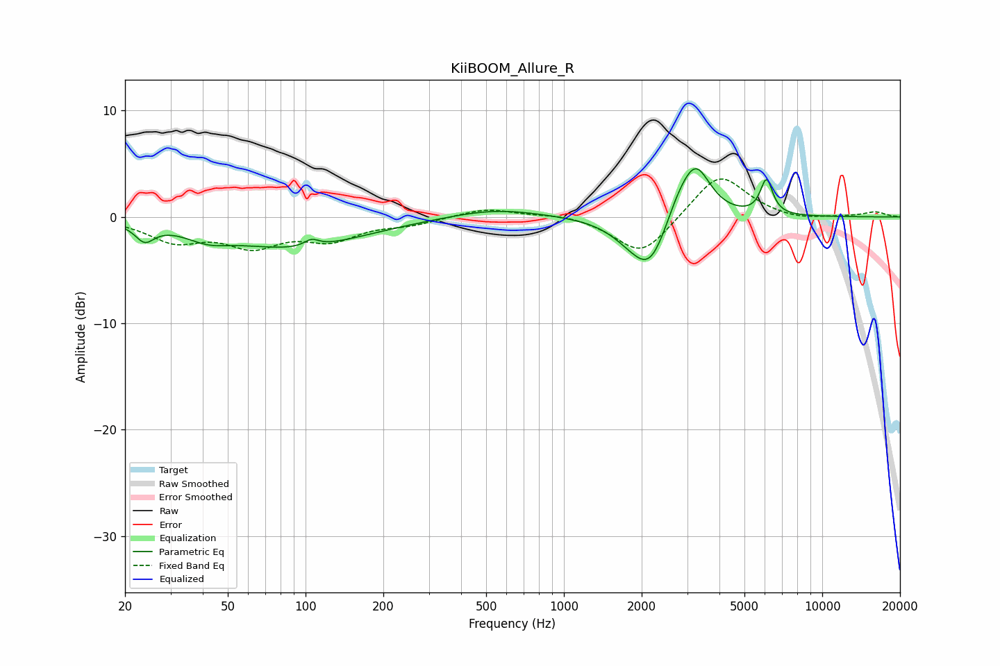

# KiiBOOM_Allure_R
See [usage instructions](https://github.com/jaakkopasanen/AutoEq#usage) for more options and info.

### Parametric EQs
Apply preamp of -4.6 dB when using parametric equalizer.

|   # | Type    |   Fc (Hz) |    Q |   Gain (dB) |
|-----|---------|-----------|------|-------------|
|   1 | Peaking |        24 | 3.93 |        -1.6 |
|   2 | Peaking |        42 | 1.72 |        -1   |
|   3 | Peaking |        90 | 0.53 |        -2.8 |
|   4 | Peaking |       105 | 5.18 |         0.7 |
|   5 | Peaking |       540 | 0.81 |         0.9 |
|   6 | Peaking |      1805 | 1.7  |        -1.1 |
|   7 | Peaking |      2162 | 1.96 |        -4.7 |
|   8 | Peaking |      2763 | 2.48 |         1.9 |
|   9 | Peaking |      3242 | 2.43 |         4.8 |
|  10 | Peaking |      6086 | 5.86 |         3.3 |

### Fixed Band EQs
When using fixed band (also called graphic) equalizer, apply preamp of **-3.7 dB** (if available) and set gains manually with these parameters.

|   # | Type    |   Fc (Hz) |    Q |   Gain (dB) |
|-----|---------|-----------|------|-------------|
|   1 | Peaking |        31 | 1.41 |        -2.1 |
|   2 | Peaking |        62 | 1.41 |        -2.4 |
|   3 | Peaking |       125 | 1.41 |        -1.9 |
|   4 | Peaking |       250 | 1.41 |        -0.6 |
|   5 | Peaking |       500 | 1.41 |         0.9 |
|   6 | Peaking |      1000 | 1.41 |         0.3 |
|   7 | Peaking |      2000 | 1.41 |        -3.7 |
|   8 | Peaking |      4000 | 1.41 |         4.2 |
|   9 | Peaking |      8000 | 1.41 |        -0.4 |
|  10 | Peaking |     16000 | 1.41 |         0.5 |

### Graphs

