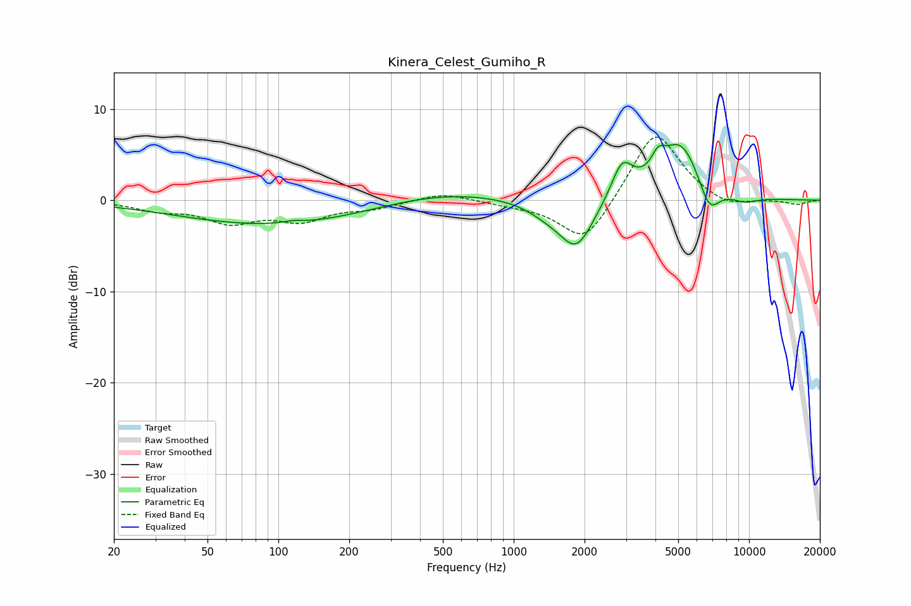

# Kinera_Celest_Gumiho_R
See [usage instructions](https://github.com/jaakkopasanen/AutoEq#usage) for more options and info.

### Parametric EQs
Apply preamp of -6.2 dB when using parametric equalizer.

|   # | Type    |   Fc (Hz) |    Q |   Gain (dB) |
|-----|---------|-----------|------|-------------|
|   1 | Peaking |       102 | 0.33 |        -2.8 |
|   2 | Peaking |       115 | 3.41 |         0.3 |
|   3 | Peaking |       459 | 0.48 |         1.3 |
|   4 | Peaking |      1385 | 1.57 |        -1.1 |
|   5 | Peaking |      1850 | 1.91 |        -5.2 |
|   6 | Peaking |      2888 | 3.08 |         3.8 |
|   7 | Peaking |      4107 | 5.06 |         1.7 |
|   8 | Peaking |      5115 | 1.49 |         6.5 |
|   9 | Peaking |      6760 | 2.96 |        -3.6 |
|  10 | Peaking |      9534 | 2.2  |        -0.7 |

### Fixed Band EQs
When using fixed band (also called graphic) equalizer, apply preamp of **-7.0 dB** (if available) and set gains manually with these parameters.

|   # | Type    |   Fc (Hz) |    Q |   Gain (dB) |
|-----|---------|-----------|------|-------------|
|   1 | Peaking |        31 | 1.41 |        -0.9 |
|   2 | Peaking |        62 | 1.41 |        -2.2 |
|   3 | Peaking |       125 | 1.41 |        -2   |
|   4 | Peaking |       250 | 1.41 |        -0.8 |
|   5 | Peaking |       500 | 1.41 |         0.9 |
|   6 | Peaking |      1000 | 1.41 |        -0.4 |
|   7 | Peaking |      2000 | 1.41 |        -5   |
|   8 | Peaking |      4000 | 1.41 |         7.9 |
|   9 | Peaking |      8000 | 1.41 |        -1   |
|  10 | Peaking |     16000 | 1.41 |        -0.5 |

### Graphs

