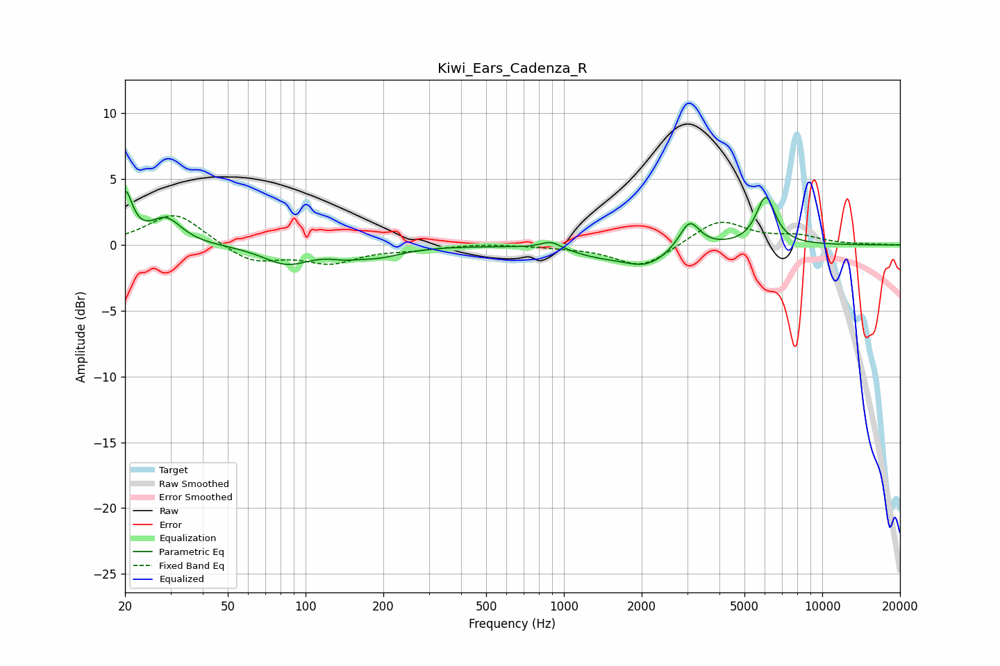

# Kiwi_Ears_Cadenza_R
See [usage instructions](https://github.com/jaakkopasanen/AutoEq#usage) for more options and info.

### Parametric EQs
Apply preamp of -4.2 dB when using parametric equalizer.

|   # | Type    |   Fc (Hz) |    Q |   Gain (dB) |
|-----|---------|-----------|------|-------------|
|   1 | Peaking |        20 | 5.15 |         3.7 |
|   2 | Peaking |        29 | 2.37 |         1.9 |
|   3 | Peaking |        84 | 1.55 |        -1.4 |
|   4 | Peaking |       141 | 2.47 |        -0.4 |
|   5 | Peaking |       190 | 1.46 |        -0.7 |
|   6 | Peaking |       891 | 3.58 |         0.6 |
|   7 | Peaking |      1358 | 1.27 |        -0.6 |
|   8 | Peaking |      2087 | 1.55 |        -1.4 |
|   9 | Peaking |      3063 | 3.58 |         2.1 |
|  10 | Peaking |      6047 | 3.72 |         3.6 |

### Fixed Band EQs
When using fixed band (also called graphic) equalizer, apply preamp of **-2.3 dB** (if available) and set gains manually with these parameters.

|   # | Type    |   Fc (Hz) |    Q |   Gain (dB) |
|-----|---------|-----------|------|-------------|
|   1 | Peaking |        31 | 1.41 |         2.5 |
|   2 | Peaking |        62 | 1.41 |        -1.4 |
|   3 | Peaking |       125 | 1.41 |        -1.3 |
|   4 | Peaking |       250 | 1.41 |        -0.3 |
|   5 | Peaking |       500 | 1.41 |         0.1 |
|   6 | Peaking |      1000 | 1.41 |        -0.1 |
|   7 | Peaking |      2000 | 1.41 |        -1.7 |
|   8 | Peaking |      4000 | 1.41 |         1.9 |
|   9 | Peaking |      8000 | 1.41 |         0.6 |
|  10 | Peaking |     16000 | 1.41 |         0   |

### Graphs

