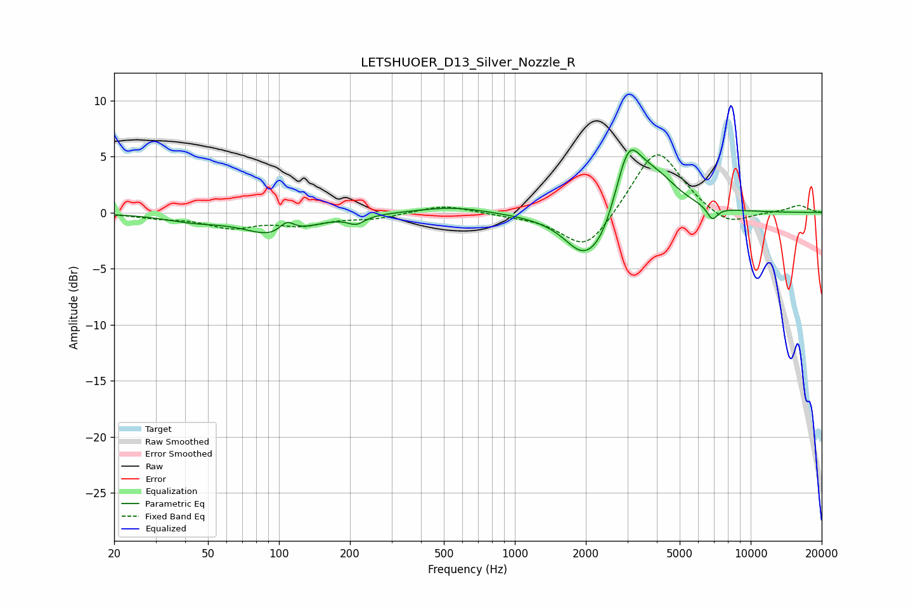

# LETSHUOER_D13_Silver_Nozzle_R
See [usage instructions](https://github.com/jaakkopasanen/AutoEq#usage) for more options and info.

### Parametric EQs
Apply preamp of -5.7 dB when using parametric equalizer.

|   # | Type    |   Fc (Hz) |    Q |   Gain (dB) |
|-----|---------|-----------|------|-------------|
|   1 | Peaking |        43 | 1.11 |        -0.6 |
|   2 | Peaking |        98 | 1.11 |        -2   |
|   3 | Peaking |       108 | 4.33 |         1.1 |
|   4 | Peaking |       213 | 4.05 |        -0.7 |
|   5 | Peaking |       541 | 0.98 |         0.6 |
|   6 | Peaking |      1877 | 2.28 |        -1   |
|   7 | Peaking |      2248 | 1.3  |        -4.8 |
|   8 | Peaking |      3018 | 2.32 |         6.6 |
|   9 | Peaking |      3951 | 1.43 |         3   |
|  10 | Peaking |      6880 | 5.97 |        -1.2 |

### Fixed Band EQs
When using fixed band (also called graphic) equalizer, apply preamp of **-5.2 dB** (if available) and set gains manually with these parameters.

|   # | Type    |   Fc (Hz) |    Q |   Gain (dB) |
|-----|---------|-----------|------|-------------|
|   1 | Peaking |        31 | 1.41 |        -0.4 |
|   2 | Peaking |        62 | 1.41 |        -1.2 |
|   3 | Peaking |       125 | 1.41 |        -1   |
|   4 | Peaking |       250 | 1.41 |        -0.5 |
|   5 | Peaking |       500 | 1.41 |         0.7 |
|   6 | Peaking |      1000 | 1.41 |        -0.2 |
|   7 | Peaking |      2000 | 1.41 |        -3.6 |
|   8 | Peaking |      4000 | 1.41 |         6   |
|   9 | Peaking |      8000 | 1.41 |        -1.4 |
|  10 | Peaking |     16000 | 1.41 |         0.6 |

### Graphs

