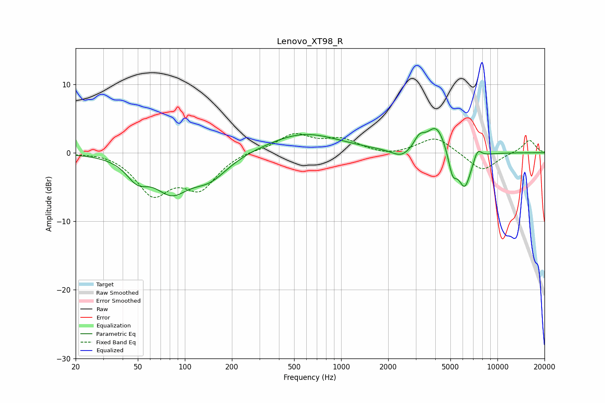

# Lenovo_XT98_R
See [usage instructions](https://github.com/jaakkopasanen/AutoEq#usage) for more options and info.

### Parametric EQs
Apply preamp of -3.6 dB when using parametric equalizer.

|   # | Type    |   Fc (Hz) |    Q |   Gain (dB) |
|-----|---------|-----------|------|-------------|
|   1 | Peaking |        50 | 2.05 |        -2.7 |
|   2 | Peaking |        82 | 1.29 |        -4.8 |
|   3 | Peaking |       144 | 1.17 |        -3.3 |
|   4 | Peaking |       576 | 0.62 |         2.9 |
|   5 | Peaking |      2442 | 2.24 |        -1.3 |
|   6 | Peaking |      3159 | 4.19 |         1.6 |
|   7 | Peaking |      4073 | 2.26 |         4.1 |
|   8 | Peaking |      5163 | 4.94 |        -3.4 |
|   9 | Peaking |      6176 | 3.27 |        -5.2 |
|  10 | Peaking |      7460 | 5.26 |         1.5 |

### Fixed Band EQs
When using fixed band (also called graphic) equalizer, apply preamp of **-2.9 dB** (if available) and set gains manually with these parameters.

|   # | Type    |   Fc (Hz) |    Q |   Gain (dB) |
|-----|---------|-----------|------|-------------|
|   1 | Peaking |        31 | 1.41 |         0.3 |
|   2 | Peaking |        62 | 1.41 |        -5.7 |
|   3 | Peaking |       125 | 1.41 |        -4.8 |
|   4 | Peaking |       250 | 1.41 |         0.4 |
|   5 | Peaking |       500 | 1.41 |         2.6 |
|   6 | Peaking |      1000 | 1.41 |         1.8 |
|   7 | Peaking |      2000 | 1.41 |        -0.5 |
|   8 | Peaking |      4000 | 1.41 |         2.4 |
|   9 | Peaking |      8000 | 1.41 |        -2.8 |
|  10 | Peaking |     16000 | 1.41 |         1.9 |

### Graphs

