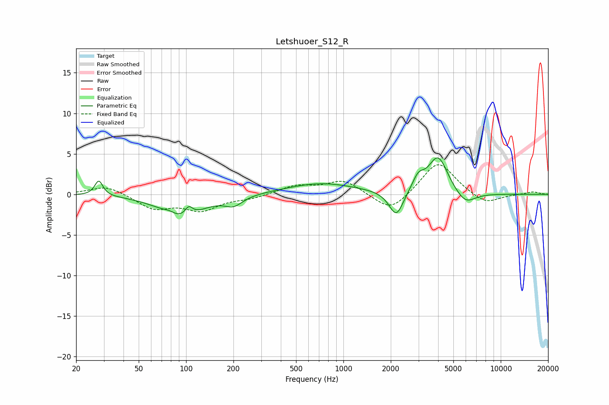

# Letshuoer_S12_R
See [usage instructions](https://github.com/jaakkopasanen/AutoEq#usage) for more options and info.

### Parametric EQs
Apply preamp of -4.6 dB when using parametric equalizer.

|   # | Type    |   Fc (Hz) |    Q |   Gain (dB) |
|-----|---------|-----------|------|-------------|
|   1 | Peaking |        28 | 5.63 |         1.9 |
|   2 | Peaking |        78 | 3.29 |         0.5 |
|   3 | Peaking |        93 | 1.1  |        -3   |
|   4 | Peaking |       104 | 5.57 |         1.2 |
|   5 | Peaking |       201 | 2.53 |        -1.1 |
|   6 | Peaking |       722 | 0.64 |         1.4 |
|   7 | Peaking |      2169 | 3.11 |        -3.2 |
|   8 | Peaking |      2987 | 3.79 |         1.6 |
|   9 | Peaking |      3995 | 2.26 |         4.6 |
|  10 | Peaking |      5946 | 2.2  |        -1.6 |

### Fixed Band EQs
When using fixed band (also called graphic) equalizer, apply preamp of **-3.7 dB** (if available) and set gains manually with these parameters.

|   # | Type    |   Fc (Hz) |    Q |   Gain (dB) |
|-----|---------|-----------|------|-------------|
|   1 | Peaking |        31 | 1.41 |         1.1 |
|   2 | Peaking |        62 | 1.41 |        -1.7 |
|   3 | Peaking |       125 | 1.41 |        -1.8 |
|   4 | Peaking |       250 | 1.41 |        -0.5 |
|   5 | Peaking |       500 | 1.41 |         1   |
|   6 | Peaking |      1000 | 1.41 |         1.7 |
|   7 | Peaking |      2000 | 1.41 |        -2.3 |
|   8 | Peaking |      4000 | 1.41 |         4.2 |
|   9 | Peaking |      8000 | 1.41 |        -1.3 |
|  10 | Peaking |     16000 | 1.41 |         0.3 |

### Graphs

