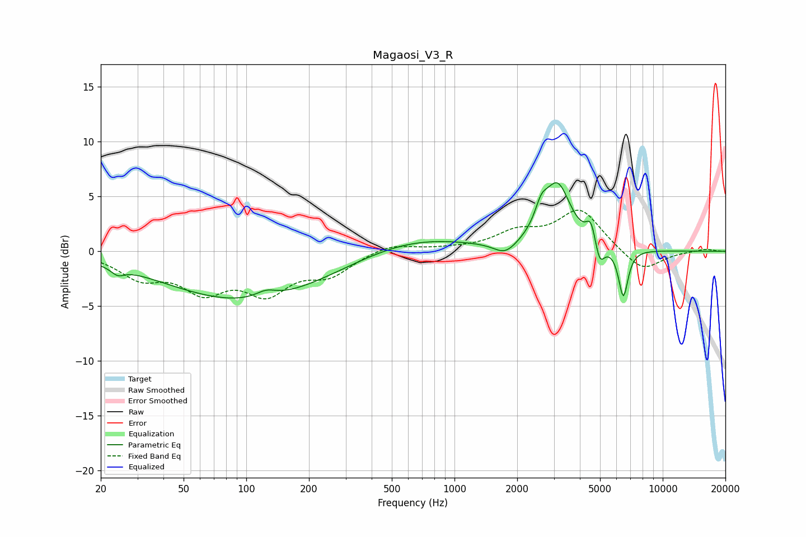

# Magaosi_V3_R
See [usage instructions](https://github.com/jaakkopasanen/AutoEq#usage) for more options and info.

### Parametric EQs
Apply preamp of -6.4 dB when using parametric equalizer.

|   # | Type    |   Fc (Hz) |    Q |   Gain (dB) |
|-----|---------|-----------|------|-------------|
|   1 | Peaking |        24 | 4.44 |        -0.7 |
|   2 | Peaking |       100 | 0.36 |        -4.5 |
|   3 | Peaking |       124 | 2.86 |         0.7 |
|   4 | Peaking |       627 | 0.53 |         1.4 |
|   5 | Peaking |      1754 | 2.59 |        -1.2 |
|   6 | Peaking |      2608 | 4.66 |         1.8 |
|   7 | Peaking |      3125 | 2.19 |         5.8 |
|   8 | Peaking |      4526 | 6    |         2   |
|   9 | Peaking |      4978 | 6    |        -2.1 |
|  10 | Peaking |      6469 | 6    |        -4.4 |

### Fixed Band EQs
When using fixed band (also called graphic) equalizer, apply preamp of **-3.8 dB** (if available) and set gains manually with these parameters.

|   # | Type    |   Fc (Hz) |    Q |   Gain (dB) |
|-----|---------|-----------|------|-------------|
|   1 | Peaking |        31 | 1.41 |        -2.1 |
|   2 | Peaking |        62 | 1.41 |        -3.2 |
|   3 | Peaking |       125 | 1.41 |        -3.4 |
|   4 | Peaking |       250 | 1.41 |        -1.9 |
|   5 | Peaking |       500 | 1.41 |         0.8 |
|   6 | Peaking |      1000 | 1.41 |         0.1 |
|   7 | Peaking |      2000 | 1.41 |         1.6 |
|   8 | Peaking |      4000 | 1.41 |         3.7 |
|   9 | Peaking |      8000 | 1.41 |        -2   |
|  10 | Peaking |     16000 | 1.41 |         0.2 |

### Graphs

