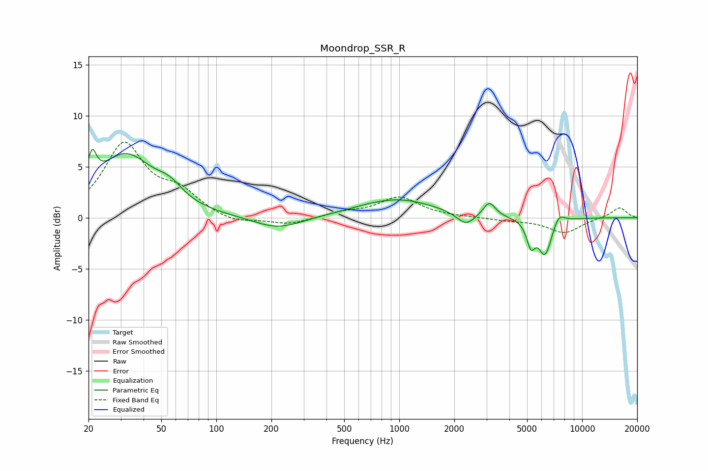

# Moondrop_SSR_R
See [usage instructions](https://github.com/jaakkopasanen/AutoEq#usage) for more options and info.

### Parametric EQs
Apply preamp of -6.8 dB when using parametric equalizer.

|   # | Type    |   Fc (Hz) |    Q |   Gain (dB) |
|-----|---------|-----------|------|-------------|
|   1 | Peaking |        21 | 5.99 |         2.9 |
|   2 | Peaking |        32 | 0.91 |         6   |
|   3 | Peaking |        55 | 2.01 |         1.3 |
|   4 | Peaking |       217 | 1.06 |        -1.2 |
|   5 | Peaking |       965 | 0.67 |         1.8 |
|   6 | Peaking |      2314 | 2.81 |        -1.2 |
|   7 | Peaking |      3106 | 4.19 |         1.5 |
|   8 | Peaking |      5248 | 6    |        -2.3 |
|   9 | Peaking |      6269 | 3.74 |        -3.6 |
|  10 | Peaking |      7458 | 4.44 |         1   |

### Fixed Band EQs
When using fixed band (also called graphic) equalizer, apply preamp of **-7.5 dB** (if available) and set gains manually with these parameters.

|   # | Type    |   Fc (Hz) |    Q |   Gain (dB) |
|-----|---------|-----------|------|-------------|
|   1 | Peaking |        31 | 1.41 |         7   |
|   2 | Peaking |        62 | 1.41 |         2.1 |
|   3 | Peaking |       125 | 1.41 |        -0.7 |
|   4 | Peaking |       250 | 1.41 |        -0.7 |
|   5 | Peaking |       500 | 1.41 |         0.5 |
|   6 | Peaking |      1000 | 1.41 |         2   |
|   7 | Peaking |      2000 | 1.41 |         0   |
|   8 | Peaking |      4000 | 1.41 |        -0.2 |
|   9 | Peaking |      8000 | 1.41 |        -1.5 |
|  10 | Peaking |     16000 | 1.41 |         1   |

### Graphs

