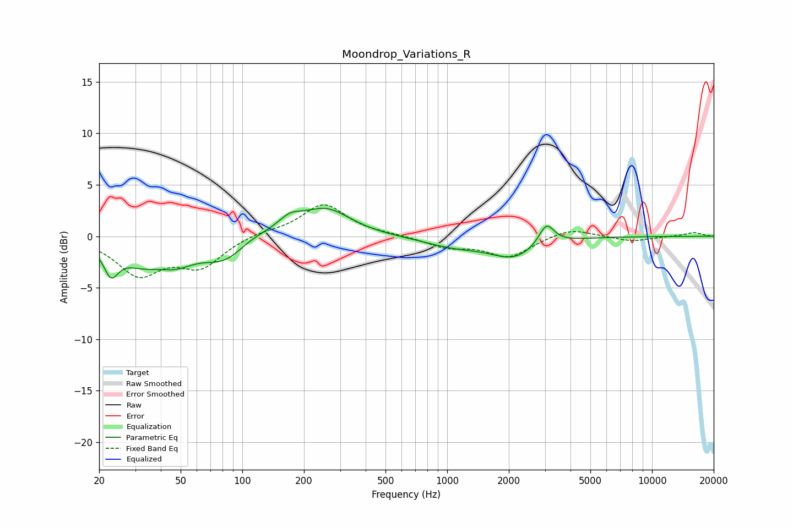

# Moondrop_Variations_R
See [usage instructions](https://github.com/jaakkopasanen/AutoEq#usage) for more options and info.

### Parametric EQs
Apply preamp of -2.8 dB when using parametric equalizer.

|   # | Type    |   Fc (Hz) |    Q |   Gain (dB) |
|-----|---------|-----------|------|-------------|
|   1 | Peaking |        23 | 4.06 |        -2.6 |
|   2 | Peaking |        32 | 1.27 |        -2   |
|   3 | Peaking |        48 | 1.53 |        -1.6 |
|   4 | Peaking |        84 | 1.26 |        -2.7 |
|   5 | Peaking |       105 | 1.25 |         1.1 |
|   6 | Peaking |       171 | 2.38 |         1.2 |
|   7 | Peaking |       255 | 1.16 |         2.7 |
|   8 | Peaking |      1095 | 0.91 |        -0.9 |
|   9 | Peaking |      2124 | 1.25 |        -1.9 |
|  10 | Peaking |      3052 | 3.8  |         2.1 |

### Fixed Band EQs
When using fixed band (also called graphic) equalizer, apply preamp of **-3.2 dB** (if available) and set gains manually with these parameters.

|   # | Type    |   Fc (Hz) |    Q |   Gain (dB) |
|-----|---------|-----------|------|-------------|
|   1 | Peaking |        31 | 1.41 |        -3.5 |
|   2 | Peaking |        62 | 1.41 |        -2.8 |
|   3 | Peaking |       125 | 1.41 |         0.4 |
|   4 | Peaking |       250 | 1.41 |         3.1 |
|   5 | Peaking |       500 | 1.41 |         0.1 |
|   6 | Peaking |      1000 | 1.41 |        -1   |
|   7 | Peaking |      2000 | 1.41 |        -2   |
|   8 | Peaking |      4000 | 1.41 |         0.9 |
|   9 | Peaking |      8000 | 1.41 |        -0.5 |
|  10 | Peaking |     16000 | 1.41 |         0.4 |

### Graphs

