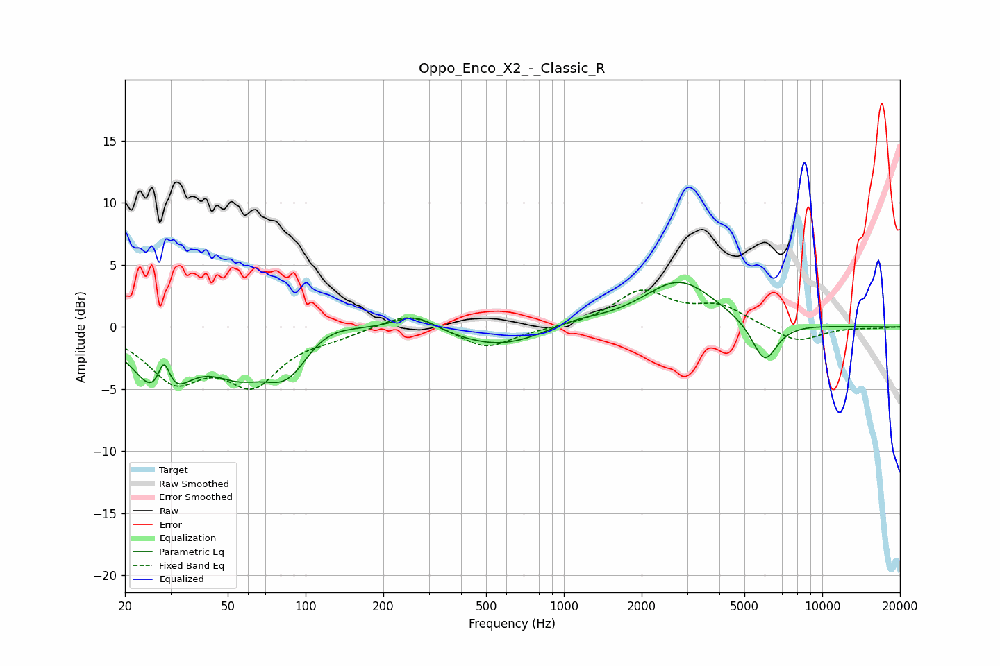

# Oppo_Enco_X2_-_Classic_R
See [usage instructions](https://github.com/jaakkopasanen/AutoEq#usage) for more options and info.

### Parametric EQs
Apply preamp of -3.7 dB when using parametric equalizer.

|   # | Type    |   Fc (Hz) |    Q |   Gain (dB) |
|-----|---------|-----------|------|-------------|
|   1 | Peaking |        28 | 1.6  |        -5.7 |
|   2 | Peaking |        28 | 5.68 |         3.4 |
|   3 | Peaking |        55 | 1.34 |        -2.6 |
|   4 | Peaking |        85 | 1.53 |        -3.7 |
|   5 | Peaking |       115 | 1.25 |         1.4 |
|   6 | Peaking |       266 | 1.72 |         1.3 |
|   7 | Peaking |       570 | 0.77 |        -1.7 |
|   8 | Peaking |      1085 | 1.24 |         0.6 |
|   9 | Peaking |      2798 | 1.01 |         3.7 |
|  10 | Peaking |      5979 | 2.78 |        -3.3 |

### Fixed Band EQs
When using fixed band (also called graphic) equalizer, apply preamp of **-3.1 dB** (if available) and set gains manually with these parameters.

|   # | Type    |   Fc (Hz) |    Q |   Gain (dB) |
|-----|---------|-----------|------|-------------|
|   1 | Peaking |        31 | 1.41 |        -3.9 |
|   2 | Peaking |        62 | 1.41 |        -4.2 |
|   3 | Peaking |       125 | 1.41 |        -0.6 |
|   4 | Peaking |       250 | 1.41 |         1.3 |
|   5 | Peaking |       500 | 1.41 |        -1.8 |
|   6 | Peaking |      1000 | 1.41 |        -0.1 |
|   7 | Peaking |      2000 | 1.41 |         2.8 |
|   8 | Peaking |      4000 | 1.41 |         1.5 |
|   9 | Peaking |      8000 | 1.41 |        -1.3 |
|  10 | Peaking |     16000 | 1.41 |        -0.1 |

### Graphs

