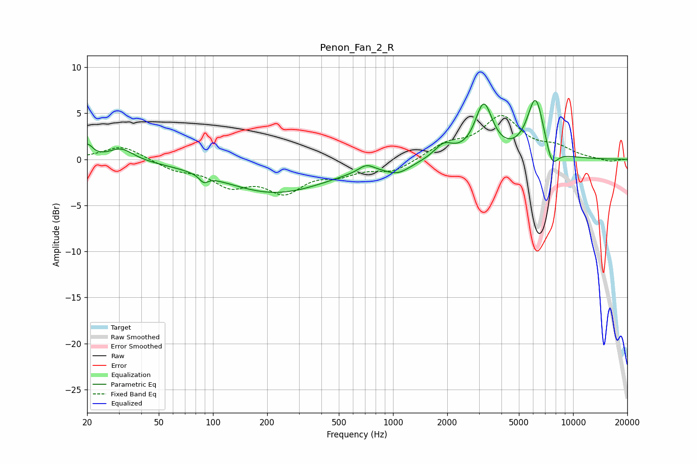

# Penon_Fan_2_R
See [usage instructions](https://github.com/jaakkopasanen/AutoEq#usage) for more options and info.

### Parametric EQs
Apply preamp of -6.5 dB when using parametric equalizer.

|   # | Type    |   Fc (Hz) |    Q |   Gain (dB) |
|-----|---------|-----------|------|-------------|
|   1 | Peaking |        20 | 4.7  |         1.5 |
|   2 | Peaking |        31 | 2.08 |         1.3 |
|   3 | Peaking |        89 | 6    |        -0.8 |
|   4 | Peaking |       222 | 0.48 |        -3.6 |
|   5 | Peaking |       711 | 3.39 |         0.8 |
|   6 | Peaking |      1063 | 1.99 |        -1.1 |
|   7 | Peaking |      1910 | 2.72 |         1.5 |
|   8 | Peaking |      3192 | 2.92 |         5.7 |
|   9 | Peaking |      6194 | 2.89 |         6.6 |
|  10 | Peaking |      7625 | 4    |        -2.4 |

### Fixed Band EQs
When using fixed band (also called graphic) equalizer, apply preamp of **-4.9 dB** (if available) and set gains manually with these parameters.

|   # | Type    |   Fc (Hz) |    Q |   Gain (dB) |
|-----|---------|-----------|------|-------------|
|   1 | Peaking |        31 | 1.41 |         1.5 |
|   2 | Peaking |        62 | 1.41 |        -1   |
|   3 | Peaking |       125 | 1.41 |        -2.5 |
|   4 | Peaking |       250 | 1.41 |        -3.1 |
|   5 | Peaking |       500 | 1.41 |        -1.3 |
|   6 | Peaking |      1000 | 1.41 |        -1.3 |
|   7 | Peaking |      2000 | 1.41 |         1.5 |
|   8 | Peaking |      4000 | 1.41 |         4.4 |
|   9 | Peaking |      8000 | 1.41 |         1.1 |
|  10 | Peaking |     16000 | 1.41 |        -0.3 |

### Graphs

