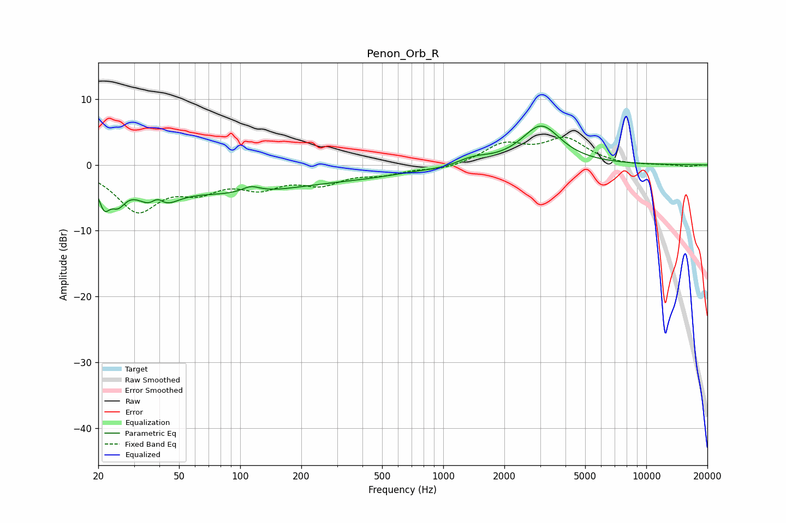

# Penon_Orb_R
See [usage instructions](https://github.com/jaakkopasanen/AutoEq#usage) for more options and info.

### Parametric EQs
Apply preamp of -6.0 dB when using parametric equalizer.

|   # | Type    |   Fc (Hz) |    Q |   Gain (dB) |
|-----|---------|-----------|------|-------------|
|   1 | Peaking |        21 | 5.07 |        -4   |
|   2 | Peaking |        25 | 3.8  |        -3   |
|   3 | Peaking |        39 | 2    |        -5.8 |
|   4 | Peaking |        39 | 3.9  |         3.3 |
|   5 | Peaking |        94 | 0.4  |        -4   |
|   6 | Peaking |       113 | 3.15 |         1   |
|   7 | Peaking |       418 | 0.61 |        -1.1 |
|   8 | Peaking |      1052 | 1.35 |        -0.4 |
|   9 | Peaking |      1387 | 1.73 |         1.1 |
|  10 | Peaking |      3037 | 1.48 |         5.9 |

### Fixed Band EQs
When using fixed band (also called graphic) equalizer, apply preamp of **-4.3 dB** (if available) and set gains manually with these parameters.

|   # | Type    |   Fc (Hz) |    Q |   Gain (dB) |
|-----|---------|-----------|------|-------------|
|   1 | Peaking |        31 | 1.41 |        -6.6 |
|   2 | Peaking |        62 | 1.41 |        -3   |
|   3 | Peaking |       125 | 1.41 |        -2.8 |
|   4 | Peaking |       250 | 1.41 |        -2.5 |
|   5 | Peaking |       500 | 1.41 |        -1.1 |
|   6 | Peaking |      1000 | 1.41 |        -0.7 |
|   7 | Peaking |      2000 | 1.41 |         3   |
|   8 | Peaking |      4000 | 1.41 |         3.7 |
|   9 | Peaking |      8000 | 1.41 |        -0.2 |
|  10 | Peaking |     16000 | 1.41 |        -0.2 |

### Graphs

