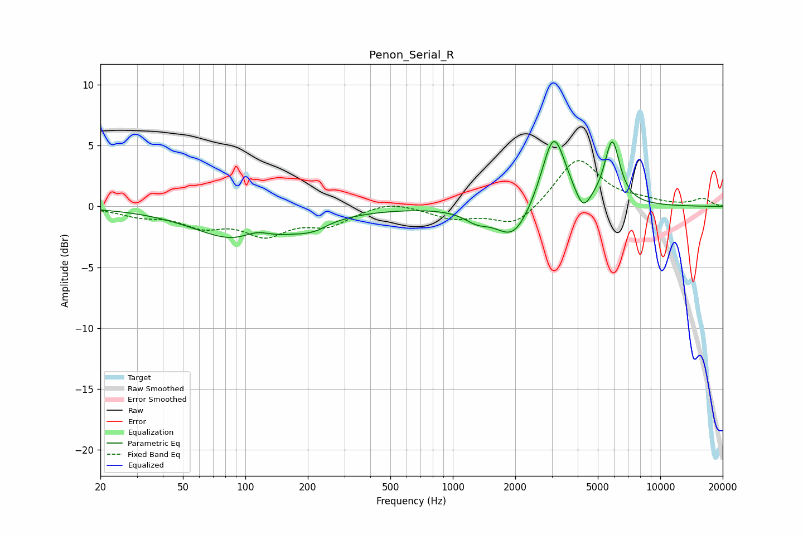

# Penon_Serial_R
See [usage instructions](https://github.com/jaakkopasanen/AutoEq#usage) for more options and info.

### Parametric EQs
Apply preamp of -5.4 dB when using parametric equalizer.

|   # | Type    |   Fc (Hz) |    Q |   Gain (dB) |
|-----|---------|-----------|------|-------------|
|   1 | Peaking |       105 | 0.63 |        -3.3 |
|   2 | Peaking |       113 | 1.82 |         1.2 |
|   3 | Peaking |       208 | 3.76 |         0.4 |
|   4 | Peaking |       210 | 2.75 |        -0.9 |
|   5 | Peaking |      1305 | 2.3  |        -0.8 |
|   6 | Peaking |      1957 | 1.7  |        -2.8 |
|   7 | Peaking |      3054 | 2.54 |         5.1 |
|   8 | Peaking |      3136 | 2.11 |         1.1 |
|   9 | Peaking |      4243 | 3.87 |        -1.7 |
|  10 | Peaking |      5866 | 3.76 |         5.2 |

### Fixed Band EQs
When using fixed band (also called graphic) equalizer, apply preamp of **-3.9 dB** (if available) and set gains manually with these parameters.

|   # | Type    |   Fc (Hz) |    Q |   Gain (dB) |
|-----|---------|-----------|------|-------------|
|   1 | Peaking |        31 | 1.41 |        -0.7 |
|   2 | Peaking |        62 | 1.41 |        -1.4 |
|   3 | Peaking |       125 | 1.41 |        -2.1 |
|   4 | Peaking |       250 | 1.41 |        -1.4 |
|   5 | Peaking |       500 | 1.41 |         0.5 |
|   6 | Peaking |      1000 | 1.41 |        -0.9 |
|   7 | Peaking |      2000 | 1.41 |        -1.7 |
|   8 | Peaking |      4000 | 1.41 |         4   |
|   9 | Peaking |      8000 | 1.41 |         0.4 |
|  10 | Peaking |     16000 | 1.41 |         0.6 |

### Graphs

