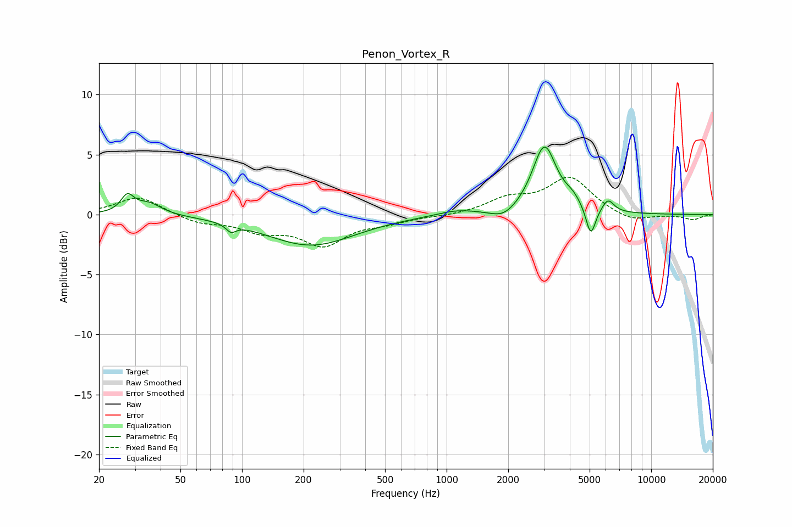

# Penon_Vortex_R
See [usage instructions](https://github.com/jaakkopasanen/AutoEq#usage) for more options and info.

### Parametric EQs
Apply preamp of -5.7 dB when using parametric equalizer.

|   # | Type    |   Fc (Hz) |    Q |   Gain (dB) |
|-----|---------|-----------|------|-------------|
|   1 | Peaking |        28 | 4.58 |         1.4 |
|   2 | Peaking |        35 | 2.23 |         1   |
|   3 | Peaking |        88 | 6    |        -0.6 |
|   4 | Peaking |       217 | 0.66 |        -2.6 |
|   5 | Peaking |      1119 | 1.44 |         0.4 |
|   6 | Peaking |      1901 | 2.3  |        -0.8 |
|   7 | Peaking |      3006 | 2.42 |         5.7 |
|   8 | Peaking |      4128 | 3.24 |         0.7 |
|   9 | Peaking |      5066 | 5.94 |        -2.5 |
|  10 | Peaking |      6147 | 4.76 |         1.1 |

### Fixed Band EQs
When using fixed band (also called graphic) equalizer, apply preamp of **-3.2 dB** (if available) and set gains manually with these parameters.

|   # | Type    |   Fc (Hz) |    Q |   Gain (dB) |
|-----|---------|-----------|------|-------------|
|   1 | Peaking |        31 | 1.41 |         1.5 |
|   2 | Peaking |        62 | 1.41 |        -0.7 |
|   3 | Peaking |       125 | 1.41 |        -1.2 |
|   4 | Peaking |       250 | 1.41 |        -2.4 |
|   5 | Peaking |       500 | 1.41 |        -0.5 |
|   6 | Peaking |      1000 | 1.41 |        -0.1 |
|   7 | Peaking |      2000 | 1.41 |         1.2 |
|   8 | Peaking |      4000 | 1.41 |         3   |
|   9 | Peaking |      8000 | 1.41 |        -0.7 |
|  10 | Peaking |     16000 | 1.41 |        -0.4 |

### Graphs

