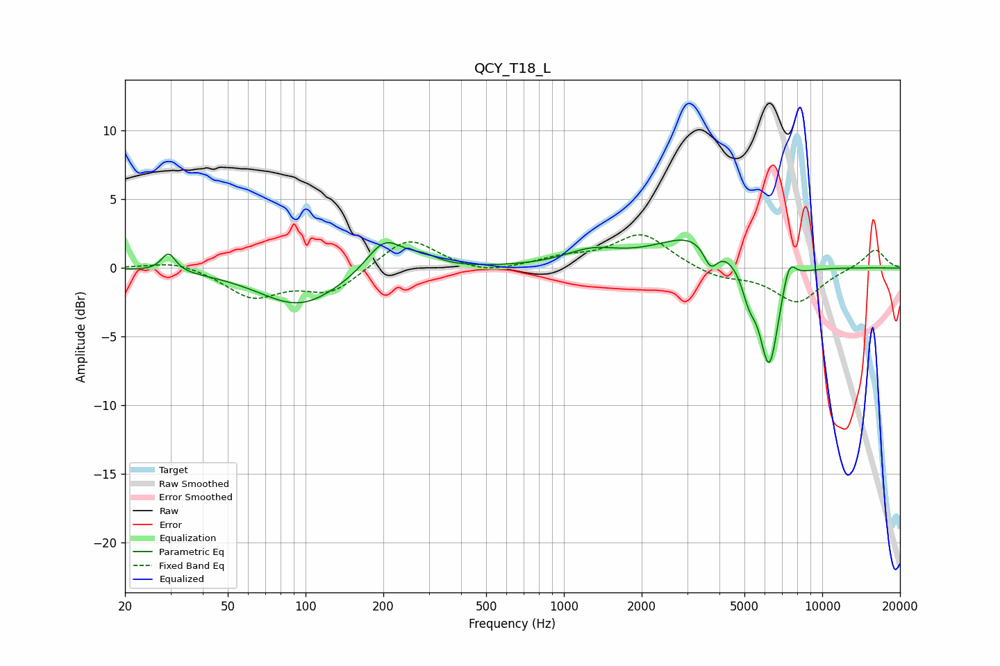

# QCY_T18_L
See [usage instructions](https://github.com/jaakkopasanen/AutoEq#usage) for more options and info.

### Parametric EQs
Apply preamp of -2.1 dB when using parametric equalizer.

|   # | Type    |   Fc (Hz) |    Q |   Gain (dB) |
|-----|---------|-----------|------|-------------|
|   1 | Peaking |        29 | 5.36 |         1.4 |
|   2 | Peaking |        95 | 0.9  |        -2.8 |
|   3 | Peaking |       202 | 1.99 |         2.5 |
|   4 | Peaking |       285 | 2.35 |         0.6 |
|   5 | Peaking |      1281 | 1.36 |         1   |
|   6 | Peaking |      3308 | 0.91 |         2.5 |
|   7 | Peaking |      3699 | 5.02 |        -1.7 |
|   8 | Peaking |      5204 | 4.95 |        -1.8 |
|   9 | Peaking |      6232 | 3.51 |        -7.7 |
|  10 | Peaking |      7434 | 5.16 |         1.9 |

### Fixed Band EQs
When using fixed band (also called graphic) equalizer, apply preamp of **-2.5 dB** (if available) and set gains manually with these parameters.

|   # | Type    |   Fc (Hz) |    Q |   Gain (dB) |
|-----|---------|-----------|------|-------------|
|   1 | Peaking |        31 | 1.41 |         0.6 |
|   2 | Peaking |        62 | 1.41 |        -2.1 |
|   3 | Peaking |       125 | 1.41 |        -1.8 |
|   4 | Peaking |       250 | 1.41 |         2.3 |
|   5 | Peaking |       500 | 1.41 |        -0.5 |
|   6 | Peaking |      1000 | 1.41 |         0.6 |
|   7 | Peaking |      2000 | 1.41 |         2.5 |
|   8 | Peaking |      4000 | 1.41 |        -0.7 |
|   9 | Peaking |      8000 | 1.41 |        -2.5 |
|  10 | Peaking |     16000 | 1.41 |         1.4 |

### Graphs

