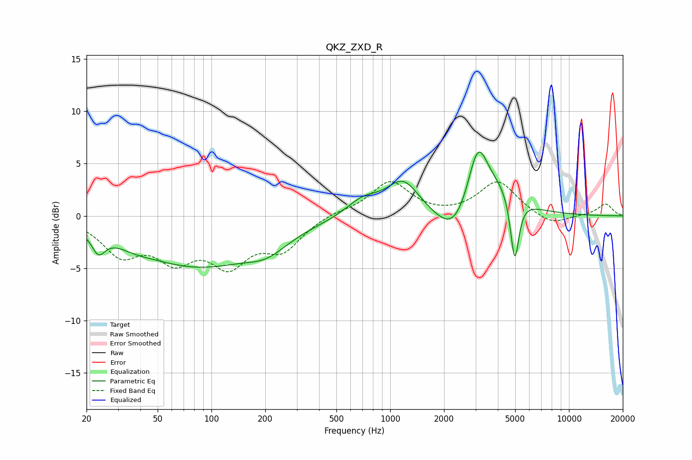

# QKZ_ZXD_R
See [usage instructions](https://github.com/jaakkopasanen/AutoEq#usage) for more options and info.

### Parametric EQs
Apply preamp of -6.2 dB when using parametric equalizer.

|   # | Type    |   Fc (Hz) |    Q |   Gain (dB) |
|-----|---------|-----------|------|-------------|
|   1 | Peaking |        23 | 3.93 |        -1.8 |
|   2 | Peaking |        37 | 1.54 |        -0.5 |
|   3 | Peaking |        84 | 0.4  |        -4.7 |
|   4 | Peaking |       205 | 1.29 |        -1.3 |
|   5 | Peaking |       705 | 1.51 |         1.5 |
|   6 | Peaking |      1180 | 1.54 |         3.3 |
|   7 | Peaking |      2292 | 1.44 |        -3   |
|   8 | Peaking |      3088 | 2.44 |         6.1 |
|   9 | Peaking |      4177 | 1.23 |         2.4 |
|  10 | Peaking |      4971 | 5.84 |        -6.4 |

### Fixed Band EQs
When using fixed band (also called graphic) equalizer, apply preamp of **-3.4 dB** (if available) and set gains manually with these parameters.

|   # | Type    |   Fc (Hz) |    Q |   Gain (dB) |
|-----|---------|-----------|------|-------------|
|   1 | Peaking |        31 | 1.41 |        -3.3 |
|   2 | Peaking |        62 | 1.41 |        -3.5 |
|   3 | Peaking |       125 | 1.41 |        -4.1 |
|   4 | Peaking |       250 | 1.41 |        -2.9 |
|   5 | Peaking |       500 | 1.41 |         0.4 |
|   6 | Peaking |      1000 | 1.41 |         3.3 |
|   7 | Peaking |      2000 | 1.41 |        -0.1 |
|   8 | Peaking |      4000 | 1.41 |         3.3 |
|   9 | Peaking |      8000 | 1.41 |        -1   |
|  10 | Peaking |     16000 | 1.41 |         1.1 |

### Graphs

