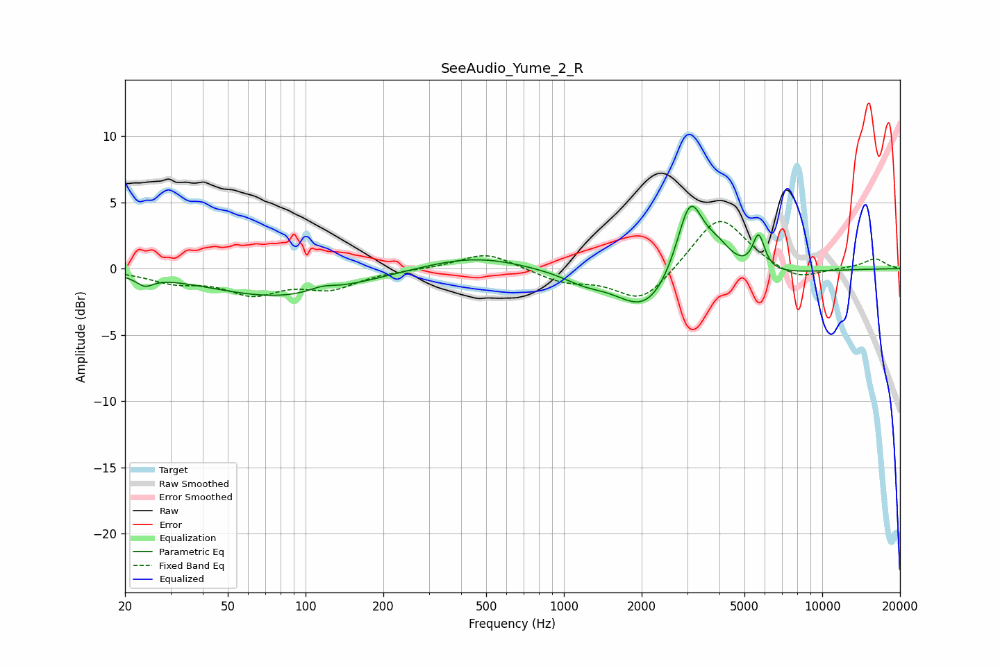

# SeeAudio_Yume_2_R
See [usage instructions](https://github.com/jaakkopasanen/AutoEq#usage) for more options and info.

### Parametric EQs
Apply preamp of -4.8 dB when using parametric equalizer.

|   # | Type    |   Fc (Hz) |    Q |   Gain (dB) |
|-----|---------|-----------|------|-------------|
|   1 | Peaking |        24 | 4.35 |        -0.7 |
|   2 | Peaking |        81 | 0.5  |        -2.1 |
|   3 | Peaking |       116 | 2.79 |         0.4 |
|   4 | Peaking |       448 | 0.71 |         1.1 |
|   5 | Peaking |      1186 | 1.87 |        -0.5 |
|   6 | Peaking |      2069 | 1.37 |        -2.5 |
|   7 | Peaking |      2932 | 0.48 |        -1.2 |
|   8 | Peaking |      3077 | 2.65 |         6.2 |
|   9 | Peaking |      3948 | 2.3  |         1.8 |
|  10 | Peaking |      5674 | 6    |         2.7 |

### Fixed Band EQs
When using fixed band (also called graphic) equalizer, apply preamp of **-3.7 dB** (if available) and set gains manually with these parameters.

|   # | Type    |   Fc (Hz) |    Q |   Gain (dB) |
|-----|---------|-----------|------|-------------|
|   1 | Peaking |        31 | 1.41 |        -0.9 |
|   2 | Peaking |        62 | 1.41 |        -1.7 |
|   3 | Peaking |       125 | 1.41 |        -1.3 |
|   4 | Peaking |       250 | 1.41 |        -0   |
|   5 | Peaking |       500 | 1.41 |         1.3 |
|   6 | Peaking |      1000 | 1.41 |        -0.9 |
|   7 | Peaking |      2000 | 1.41 |        -2.6 |
|   8 | Peaking |      4000 | 1.41 |         4.2 |
|   9 | Peaking |      8000 | 1.41 |        -1   |
|  10 | Peaking |     16000 | 1.41 |         0.7 |

### Graphs

