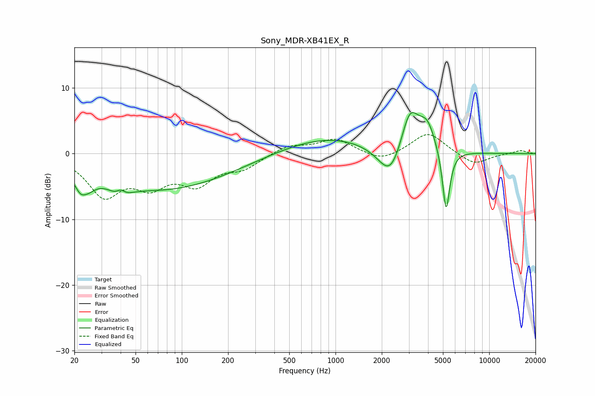

# Sony_MDR-XB41EX_R
See [usage instructions](https://github.com/jaakkopasanen/AutoEq#usage) for more options and info.

### Parametric EQs
Apply preamp of -6.4 dB when using parametric equalizer.

|   # | Type    |   Fc (Hz) |    Q |   Gain (dB) |
|-----|---------|-----------|------|-------------|
|   1 | Peaking |        22 | 3.84 |        -2.1 |
|   2 | Peaking |        25 | 3.06 |        -1.4 |
|   3 | Peaking |        40 | 3.1  |        -4.9 |
|   4 | Peaking |        40 | 3.92 |         4.3 |
|   5 | Peaking |        72 | 0.3  |        -5.5 |
|   6 | Peaking |       896 | 0.46 |         2.6 |
|   7 | Peaking |      2288 | 1.76 |        -5.5 |
|   8 | Peaking |      3041 | 2.32 |         6.9 |
|   9 | Peaking |      3953 | 2.65 |         3.8 |
|  10 | Peaking |      5243 | 5.78 |        -9.9 |

### Fixed Band EQs
When using fixed band (also called graphic) equalizer, apply preamp of **-3.0 dB** (if available) and set gains manually with these parameters.

|   # | Type    |   Fc (Hz) |    Q |   Gain (dB) |
|-----|---------|-----------|------|-------------|
|   1 | Peaking |        31 | 1.41 |        -6   |
|   2 | Peaking |        62 | 1.41 |        -4   |
|   3 | Peaking |       125 | 1.41 |        -4.1 |
|   4 | Peaking |       250 | 1.41 |        -1.9 |
|   5 | Peaking |       500 | 1.41 |         1.3 |
|   6 | Peaking |      1000 | 1.41 |         2.2 |
|   7 | Peaking |      2000 | 1.41 |        -1.3 |
|   8 | Peaking |      4000 | 1.41 |         3.3 |
|   9 | Peaking |      8000 | 1.41 |        -1.8 |
|  10 | Peaking |     16000 | 1.41 |         0.5 |

### Graphs

