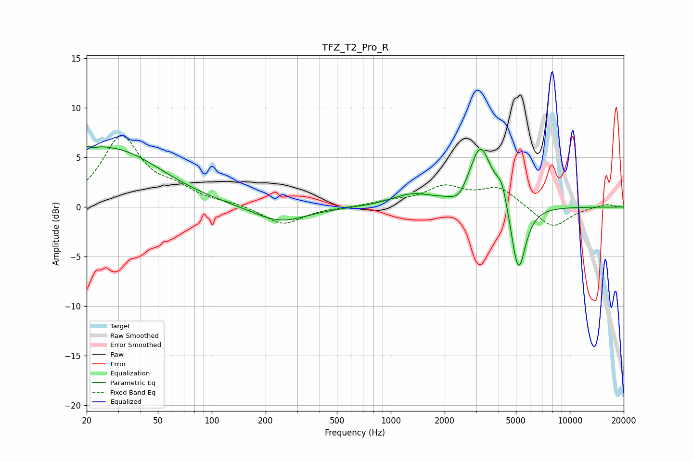

# TFZ_T2_Pro_R
See [usage instructions](https://github.com/jaakkopasanen/AutoEq#usage) for more options and info.

### Parametric EQs
Apply preamp of -6.2 dB when using parametric equalizer.

|   # | Type    |   Fc (Hz) |    Q |   Gain (dB) |
|-----|---------|-----------|------|-------------|
|   1 | Peaking |        21 | 1.82 |         1.3 |
|   2 | Peaking |        21 | 5.94 |         3.2 |
|   3 | Peaking |        21 | 5.94 |        -3   |
|   4 | Peaking |        30 | 0.55 |         5.4 |
|   5 | Peaking |       240 | 0.95 |        -1.6 |
|   6 | Peaking |      1314 | 1.23 |         1.2 |
|   7 | Peaking |      2395 | 3.35 |        -1   |
|   8 | Peaking |      3171 | 2.32 |         6.1 |
|   9 | Peaking |      4177 | 4.28 |         2.3 |
|  10 | Peaking |      5158 | 3.38 |        -7.3 |

### Fixed Band EQs
When using fixed band (also called graphic) equalizer, apply preamp of **-7.3 dB** (if available) and set gains manually with these parameters.

|   # | Type    |   Fc (Hz) |    Q |   Gain (dB) |
|-----|---------|-----------|------|-------------|
|   1 | Peaking |        31 | 1.41 |         6.9 |
|   2 | Peaking |        62 | 1.41 |         1.4 |
|   3 | Peaking |       125 | 1.41 |         0.3 |
|   4 | Peaking |       250 | 1.41 |        -1.8 |
|   5 | Peaking |       500 | 1.41 |        -0   |
|   6 | Peaking |      1000 | 1.41 |         0.5 |
|   7 | Peaking |      2000 | 1.41 |         1.9 |
|   8 | Peaking |      4000 | 1.41 |         1.9 |
|   9 | Peaking |      8000 | 1.41 |        -2.2 |
|  10 | Peaking |     16000 | 1.41 |         0.3 |

### Graphs

