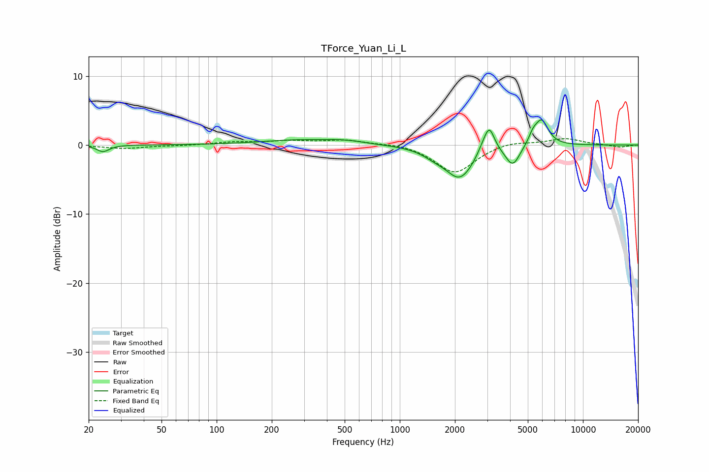

# TForce_Yuan_Li_L
See [usage instructions](https://github.com/jaakkopasanen/AutoEq#usage) for more options and info.

### Parametric EQs
Apply preamp of -3.7 dB when using parametric equalizer.

|   # | Type    |   Fc (Hz) |    Q |   Gain (dB) |
|-----|---------|-----------|------|-------------|
|   1 | Peaking |        24 | 4.38 |        -1   |
|   2 | Peaking |       286 | 0.67 |         0.7 |
|   3 | Peaking |       507 | 1.36 |         0.4 |
|   4 | Peaking |      1542 | 2.16 |        -0.7 |
|   5 | Peaking |      2128 | 1.79 |        -4.7 |
|   6 | Peaking |      2836 | 4.24 |         1   |
|   7 | Peaking |      3083 | 4.9  |         3.5 |
|   8 | Peaking |      4136 | 3.61 |        -2.9 |
|   9 | Peaking |      5324 | 6    |         1.2 |
|  10 | Peaking |      5940 | 3.72 |         3.7 |

### Fixed Band EQs
When using fixed band (also called graphic) equalizer, apply preamp of **-1.0 dB** (if available) and set gains manually with these parameters.

|   # | Type    |   Fc (Hz) |    Q |   Gain (dB) |
|-----|---------|-----------|------|-------------|
|   1 | Peaking |        31 | 1.41 |        -0.5 |
|   2 | Peaking |        62 | 1.41 |        -0.1 |
|   3 | Peaking |       125 | 1.41 |         0.4 |
|   4 | Peaking |       250 | 1.41 |         0.5 |
|   5 | Peaking |       500 | 1.41 |         0.7 |
|   6 | Peaking |      1000 | 1.41 |         0.3 |
|   7 | Peaking |      2000 | 1.41 |        -4.1 |
|   8 | Peaking |      4000 | 1.41 |         0.6 |
|   9 | Peaking |      8000 | 1.41 |         0.9 |
|  10 | Peaking |     16000 | 1.41 |        -0.3 |

### Graphs

