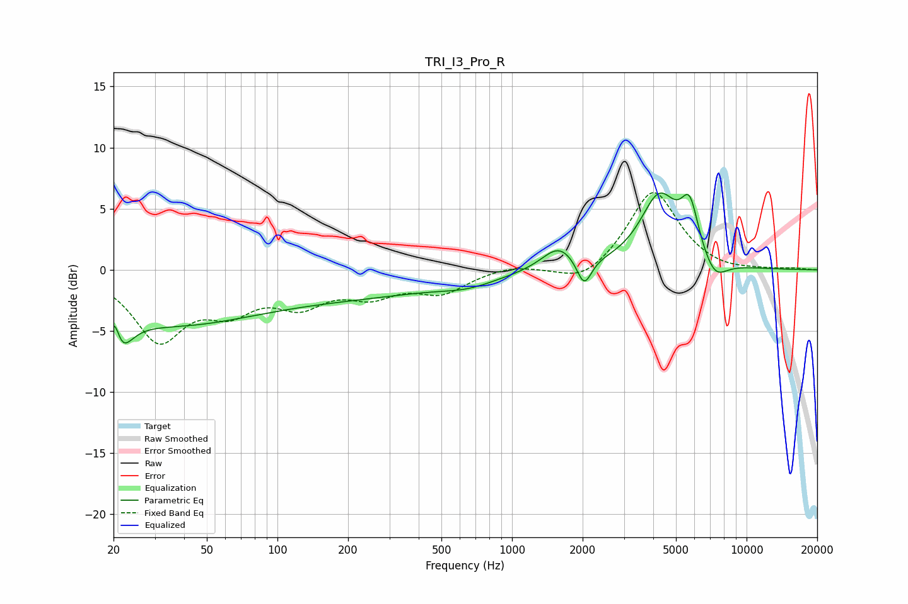

# TRI_I3_Pro_R
See [usage instructions](https://github.com/jaakkopasanen/AutoEq#usage) for more options and info.

### Parametric EQs
Apply preamp of -6.4 dB when using parametric equalizer.

|   # | Type    |   Fc (Hz) |    Q |   Gain (dB) |
|-----|---------|-----------|------|-------------|
|   1 | Peaking |        20 | 5.92 |         3.2 |
|   2 | Peaking |        21 | 3.07 |        -4.4 |
|   3 | Peaking |        35 | 0.38 |        -4.1 |
|   4 | Peaking |       224 | 0.36 |        -1.8 |
|   5 | Peaking |       650 | 1.19 |        -0.6 |
|   6 | Peaking |      1583 | 1.97 |         1.9 |
|   7 | Peaking |      2030 | 4.52 |        -2.3 |
|   8 | Peaking |      4241 | 1.72 |         5.8 |
|   9 | Peaking |      5721 | 3.67 |         4   |
|  10 | Peaking |      7310 | 2.59 |        -1.7 |

### Fixed Band EQs
When using fixed band (also called graphic) equalizer, apply preamp of **-6.4 dB** (if available) and set gains manually with these parameters.

|   # | Type    |   Fc (Hz) |    Q |   Gain (dB) |
|-----|---------|-----------|------|-------------|
|   1 | Peaking |        31 | 1.41 |        -5.5 |
|   2 | Peaking |        62 | 1.41 |        -2.7 |
|   3 | Peaking |       125 | 1.41 |        -2.4 |
|   4 | Peaking |       250 | 1.41 |        -1.8 |
|   5 | Peaking |       500 | 1.41 |        -1.7 |
|   6 | Peaking |      1000 | 1.41 |         0.4 |
|   7 | Peaking |      2000 | 1.41 |        -1.3 |
|   8 | Peaking |      4000 | 1.41 |         6.6 |
|   9 | Peaking |      8000 | 1.41 |        -0.3 |
|  10 | Peaking |     16000 | 1.41 |         0.1 |

### Graphs

