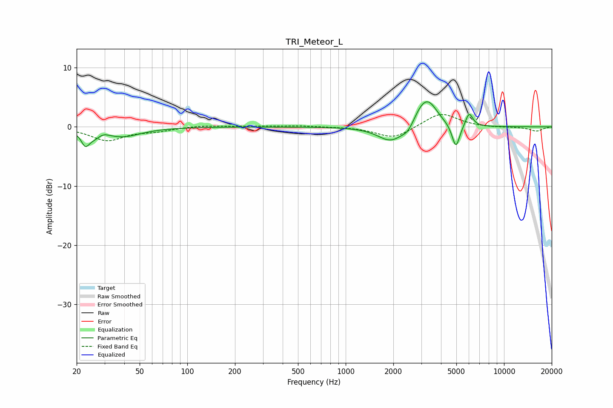

# TRI_Meteor_L
See [usage instructions](https://github.com/jaakkopasanen/AutoEq#usage) for more options and info.

### Parametric EQs
Apply preamp of -4.3 dB when using parametric equalizer.

|   # | Type    |   Fc (Hz) |    Q |   Gain (dB) |
|-----|---------|-----------|------|-------------|
|   1 | Peaking |        23 | 5.66 |        -2.1 |
|   2 | Peaking |        26 | 2.54 |        -1.5 |
|   3 | Peaking |        29 | 3.46 |         1   |
|   4 | Peaking |        39 | 1.2  |        -1.5 |
|   5 | Peaking |      1935 | 1.72 |        -2.7 |
|   6 | Peaking |      2482 | 3.89 |        -1.1 |
|   7 | Peaking |      2950 | 2.83 |         1.4 |
|   8 | Peaking |      3322 | 2.28 |         4.1 |
|   9 | Peaking |      4966 | 5.7  |        -4.1 |
|  10 | Peaking |      6022 | 6    |         2.4 |

### Fixed Band EQs
When using fixed band (also called graphic) equalizer, apply preamp of **-2.2 dB** (if available) and set gains manually with these parameters.

|   # | Type    |   Fc (Hz) |    Q |   Gain (dB) |
|-----|---------|-----------|------|-------------|
|   1 | Peaking |        31 | 1.41 |        -2.2 |
|   2 | Peaking |        62 | 1.41 |        -0.6 |
|   3 | Peaking |       125 | 1.41 |         0.3 |
|   4 | Peaking |       250 | 1.41 |         0.1 |
|   5 | Peaking |       500 | 1.41 |         0.2 |
|   6 | Peaking |      1000 | 1.41 |         0   |
|   7 | Peaking |      2000 | 1.41 |        -2   |
|   8 | Peaking |      4000 | 1.41 |         2.4 |
|   9 | Peaking |      8000 | 1.41 |        -0.1 |
|  10 | Peaking |     16000 | 1.41 |        -0.7 |

### Graphs

