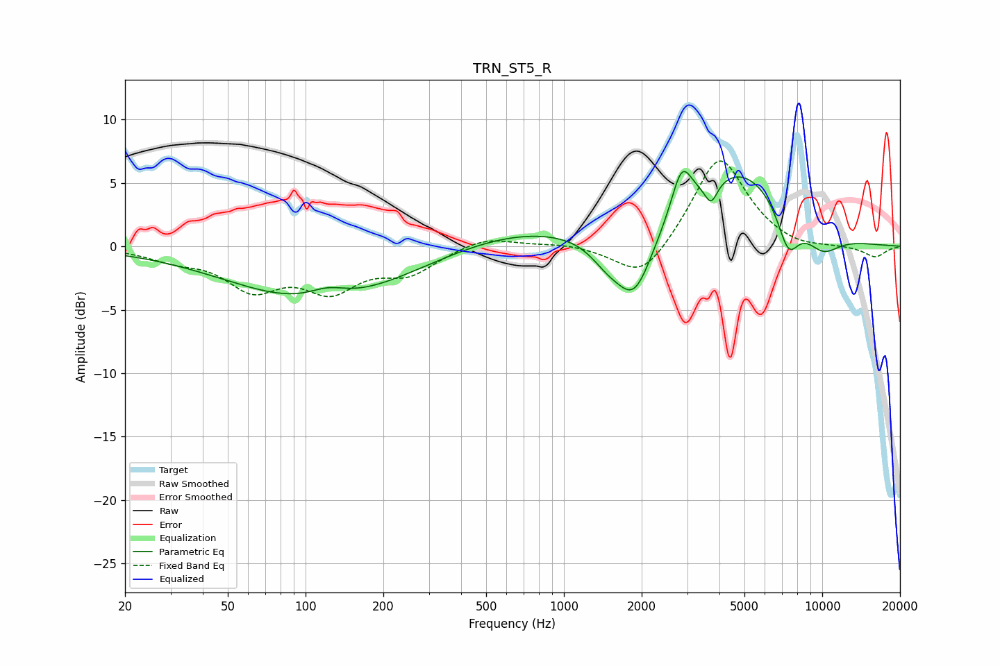

# TRN_ST5_R
See [usage instructions](https://github.com/jaakkopasanen/AutoEq#usage) for more options and info.

### Parametric EQs
Apply preamp of -6.0 dB when using parametric equalizer.

|   # | Type    |   Fc (Hz) |    Q |   Gain (dB) |
|-----|---------|-----------|------|-------------|
|   1 | Peaking |       113 | 0.41 |        -4.3 |
|   2 | Peaking |       122 | 1.93 |         0.9 |
|   3 | Peaking |       697 | 0.48 |         1.5 |
|   4 | Peaking |      1470 | 2.12 |        -1.5 |
|   5 | Peaking |      1873 | 1.96 |        -5   |
|   6 | Peaking |      2859 | 3.56 |         3.7 |
|   7 | Peaking |      3714 | 5.69 |        -1.7 |
|   8 | Peaking |      4811 | 0.74 |         6   |
|   9 | Peaking |      7388 | 3.21 |        -3.3 |
|  10 | Peaking |     10000 | 1.74 |        -1.8 |

### Fixed Band EQs
When using fixed band (also called graphic) equalizer, apply preamp of **-6.8 dB** (if available) and set gains manually with these parameters.

|   # | Type    |   Fc (Hz) |    Q |   Gain (dB) |
|-----|---------|-----------|------|-------------|
|   1 | Peaking |        31 | 1.41 |        -0.8 |
|   2 | Peaking |        62 | 1.41 |        -3   |
|   3 | Peaking |       125 | 1.41 |        -3   |
|   4 | Peaking |       250 | 1.41 |        -1.9 |
|   5 | Peaking |       500 | 1.41 |         0.9 |
|   6 | Peaking |      1000 | 1.41 |         0.2 |
|   7 | Peaking |      2000 | 1.41 |        -2.9 |
|   8 | Peaking |      4000 | 1.41 |         7.3 |
|   9 | Peaking |      8000 | 1.41 |        -0.4 |
|  10 | Peaking |     16000 | 1.41 |        -0.9 |

### Graphs

