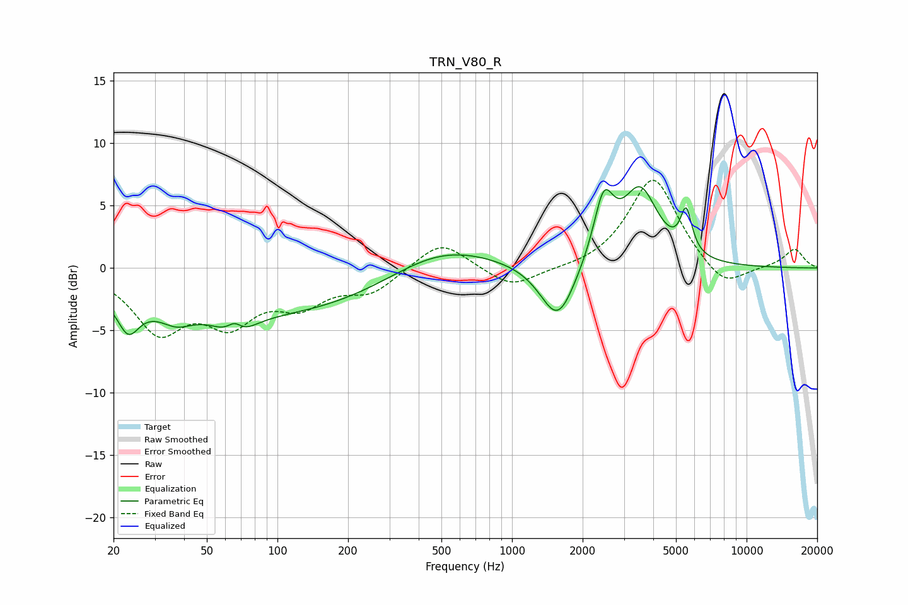

# TRN_V80_R
See [usage instructions](https://github.com/jaakkopasanen/AutoEq#usage) for more options and info.

### Parametric EQs
Apply preamp of -6.6 dB when using parametric equalizer.

|   # | Type    |   Fc (Hz) |    Q |   Gain (dB) |
|-----|---------|-----------|------|-------------|
|   1 | Peaking |        23 | 3.14 |        -2.7 |
|   2 | Peaking |        37 | 2.16 |        -1.1 |
|   3 | Peaking |        66 | 3.55 |         3.3 |
|   4 | Peaking |        66 | 2.63 |        -4   |
|   5 | Peaking |        86 | 0.22 |        -3.8 |
|   6 | Peaking |       485 | 0.61 |         2.6 |
|   7 | Peaking |      1568 | 1.91 |        -4.8 |
|   8 | Peaking |      2459 | 3.29 |         5   |
|   9 | Peaking |      3519 | 1.84 |         6   |
|  10 | Peaking |      5529 | 5.73 |         3.4 |

### Fixed Band EQs
When using fixed band (also called graphic) equalizer, apply preamp of **-7.1 dB** (if available) and set gains manually with these parameters.

|   # | Type    |   Fc (Hz) |    Q |   Gain (dB) |
|-----|---------|-----------|------|-------------|
|   1 | Peaking |        31 | 1.41 |        -4.7 |
|   2 | Peaking |        62 | 1.41 |        -3.8 |
|   3 | Peaking |       125 | 1.41 |        -2.5 |
|   4 | Peaking |       250 | 1.41 |        -1.8 |
|   5 | Peaking |       500 | 1.41 |         2.3 |
|   6 | Peaking |      1000 | 1.41 |        -1.7 |
|   7 | Peaking |      2000 | 1.41 |        -0.2 |
|   8 | Peaking |      4000 | 1.41 |         7.4 |
|   9 | Peaking |      8000 | 1.41 |        -1.9 |
|  10 | Peaking |     16000 | 1.41 |         1.5 |

### Graphs

