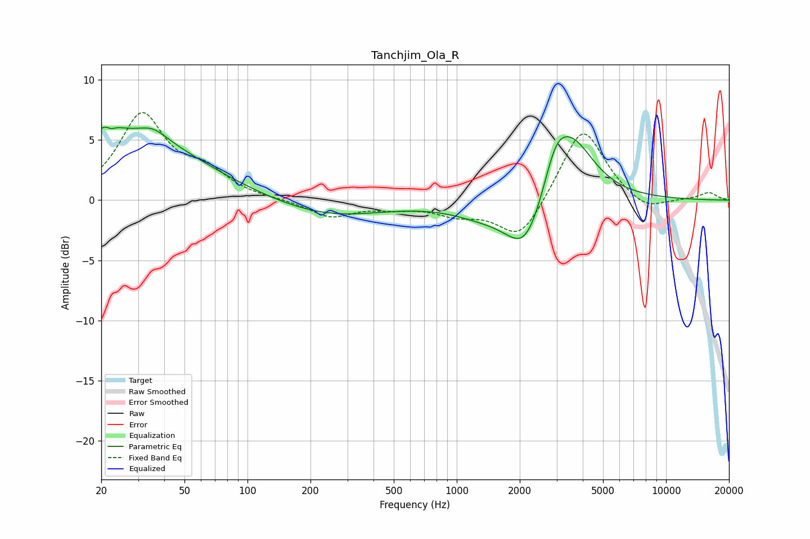

# Tanchjim_Ola_R
See [usage instructions](https://github.com/jaakkopasanen/AutoEq#usage) for more options and info.

### Parametric EQs
Apply preamp of -6.2 dB when using parametric equalizer.

|   # | Type    |   Fc (Hz) |    Q |   Gain (dB) |
|-----|---------|-----------|------|-------------|
|   1 | Peaking |        21 | 2.83 |         1.1 |
|   2 | Peaking |        22 | 5.83 |         3.1 |
|   3 | Peaking |        22 | 5.95 |        -3.5 |
|   4 | Peaking |        27 | 0.41 |         5.3 |
|   5 | Peaking |        35 | 2.13 |         0.8 |
|   6 | Peaking |       244 | 0.54 |        -1.4 |
|   7 | Peaking |      1327 | 0.93 |        -1   |
|   8 | Peaking |      2141 | 1.48 |        -4.7 |
|   9 | Peaking |      2963 | 2.43 |         2.8 |
|  10 | Peaking |      3538 | 1.28 |         5.2 |

### Fixed Band EQs
When using fixed band (also called graphic) equalizer, apply preamp of **-7.4 dB** (if available) and set gains manually with these parameters.

|   # | Type    |   Fc (Hz) |    Q |   Gain (dB) |
|-----|---------|-----------|------|-------------|
|   1 | Peaking |        31 | 1.41 |         6.9 |
|   2 | Peaking |        62 | 1.41 |         2   |
|   3 | Peaking |       125 | 1.41 |         0   |
|   4 | Peaking |       250 | 1.41 |        -1.4 |
|   5 | Peaking |       500 | 1.41 |        -0.5 |
|   6 | Peaking |      1000 | 1.41 |        -1   |
|   7 | Peaking |      2000 | 1.41 |        -3.4 |
|   8 | Peaking |      4000 | 1.41 |         6.3 |
|   9 | Peaking |      8000 | 1.41 |        -1.1 |
|  10 | Peaking |     16000 | 1.41 |         0.6 |

### Graphs

