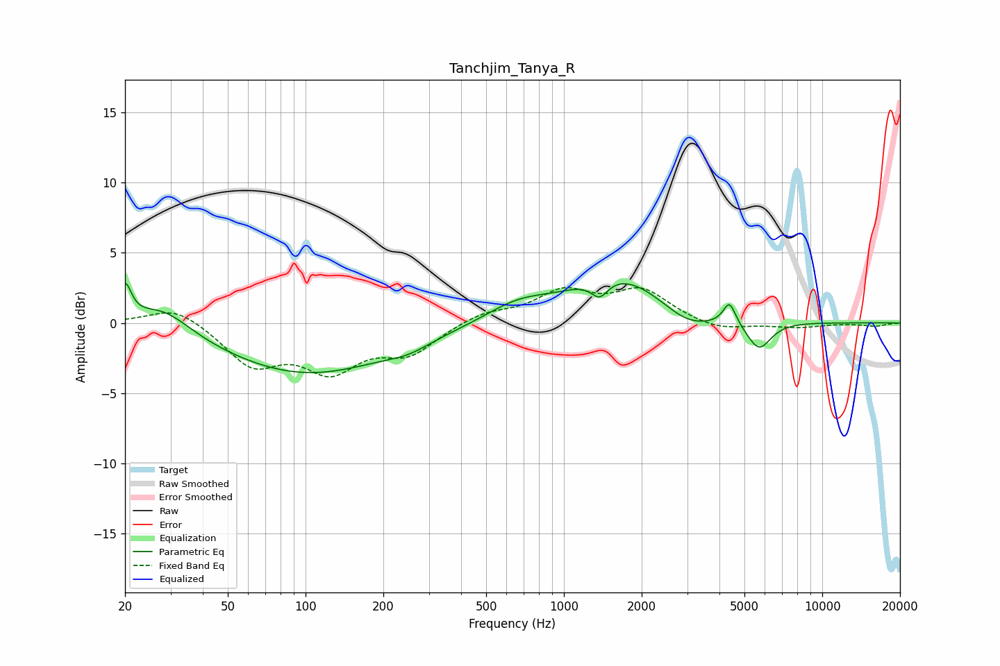

# Tanchjim_Tanya_R
See [usage instructions](https://github.com/jaakkopasanen/AutoEq#usage) for more options and info.

### Parametric EQs
Apply preamp of -2.9 dB when using parametric equalizer.

|   # | Type    |   Fc (Hz) |    Q |   Gain (dB) |
|-----|---------|-----------|------|-------------|
|   1 | Peaking |        20 | 5.87 |         2.5 |
|   2 | Peaking |        28 | 1.31 |         1.9 |
|   3 | Peaking |       101 | 0.43 |        -3.6 |
|   4 | Peaking |       250 | 1.7  |        -0.5 |
|   5 | Peaking |       660 | 1.12 |         1.2 |
|   6 | Peaking |      1375 | 4.26 |        -1.2 |
|   7 | Peaking |      1632 | 0.74 |         3.4 |
|   8 | Peaking |      3006 | 1.37 |        -1.4 |
|   9 | Peaking |      4374 | 5.89 |         1.6 |
|  10 | Peaking |      5690 | 2.96 |        -2   |

### Fixed Band EQs
When using fixed band (also called graphic) equalizer, apply preamp of **-2.6 dB** (if available) and set gains manually with these parameters.

|   # | Type    |   Fc (Hz) |    Q |   Gain (dB) |
|-----|---------|-----------|------|-------------|
|   1 | Peaking |        31 | 1.41 |         1.3 |
|   2 | Peaking |        62 | 1.41 |        -2.9 |
|   3 | Peaking |       125 | 1.41 |        -3   |
|   4 | Peaking |       250 | 1.41 |        -2   |
|   5 | Peaking |       500 | 1.41 |         0.7 |
|   6 | Peaking |      1000 | 1.41 |         2.1 |
|   7 | Peaking |      2000 | 1.41 |         2.2 |
|   8 | Peaking |      4000 | 1.41 |        -0.6 |
|   9 | Peaking |      8000 | 1.41 |        -0.3 |
|  10 | Peaking |     16000 | 1.41 |        -0.2 |

### Graphs

