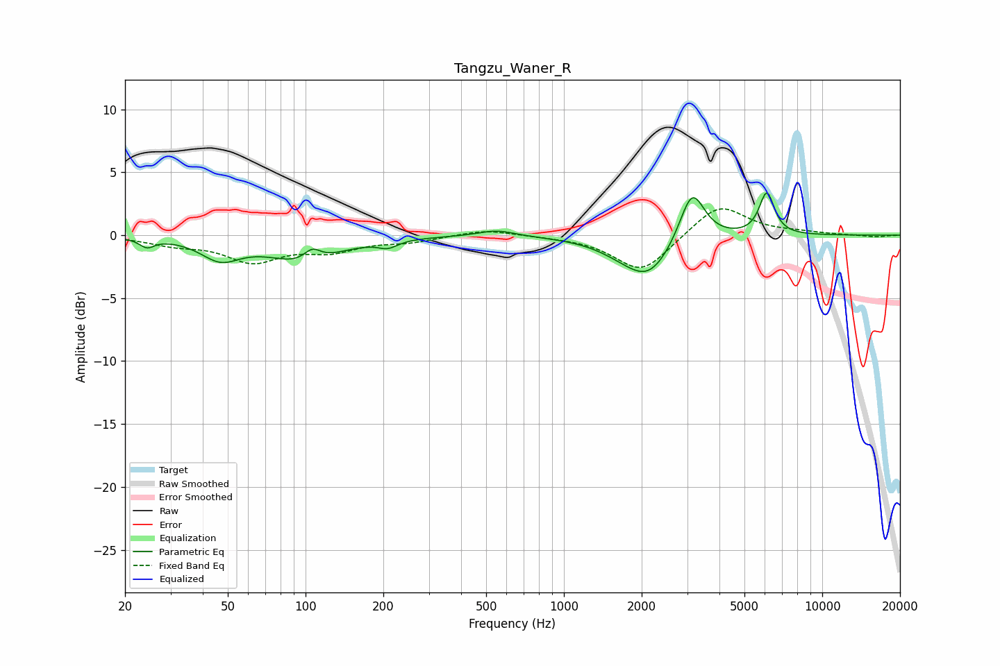

# Tangzu_Waner_R
See [usage instructions](https://github.com/jaakkopasanen/AutoEq#usage) for more options and info.

### Parametric EQs
Apply preamp of -3.5 dB when using parametric equalizer.

|   # | Type    |   Fc (Hz) |    Q |   Gain (dB) |
|-----|---------|-----------|------|-------------|
|   1 | Peaking |        24 | 5.12 |        -0.7 |
|   2 | Peaking |        47 | 1.88 |        -1.6 |
|   3 | Peaking |        99 | 1.06 |        -2   |
|   4 | Peaking |       106 | 4.25 |         1   |
|   5 | Peaking |       208 | 3.81 |        -0.6 |
|   6 | Peaking |       549 | 1.99 |         0.5 |
|   7 | Peaking |      1731 | 1.29 |        -0.8 |
|   8 | Peaking |      2145 | 1.58 |        -2.8 |
|   9 | Peaking |      3133 | 2.92 |         4.2 |
|  10 | Peaking |      6101 | 4.77 |         3.4 |

### Fixed Band EQs
When using fixed band (also called graphic) equalizer, apply preamp of **-2.2 dB** (if available) and set gains manually with these parameters.

|   # | Type    |   Fc (Hz) |    Q |   Gain (dB) |
|-----|---------|-----------|------|-------------|
|   1 | Peaking |        31 | 1.41 |        -0.6 |
|   2 | Peaking |        62 | 1.41 |        -2   |
|   3 | Peaking |       125 | 1.41 |        -1.1 |
|   4 | Peaking |       250 | 1.41 |        -0.4 |
|   5 | Peaking |       500 | 1.41 |         0.5 |
|   6 | Peaking |      1000 | 1.41 |        -0.1 |
|   7 | Peaking |      2000 | 1.41 |        -3   |
|   8 | Peaking |      4000 | 1.41 |         2.6 |
|   9 | Peaking |      8000 | 1.41 |         0.2 |
|  10 | Peaking |     16000 | 1.41 |        -0.2 |

### Graphs

