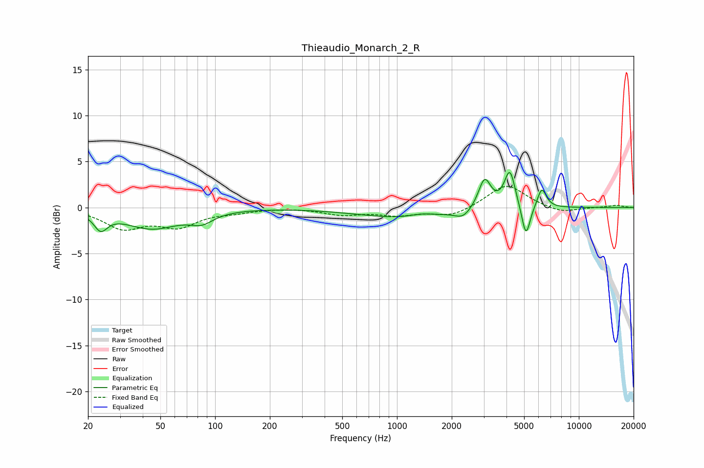

# Thieaudio_Monarch_2_R
See [usage instructions](https://github.com/jaakkopasanen/AutoEq#usage) for more options and info.

### Parametric EQs
Apply preamp of -3.9 dB when using parametric equalizer.

|   # | Type    |   Fc (Hz) |    Q |   Gain (dB) |
|-----|---------|-----------|------|-------------|
|   1 | Peaking |        23 | 3.9  |        -1.8 |
|   2 | Peaking |        45 | 0.93 |        -2.2 |
|   3 | Peaking |        84 | 2.25 |        -1   |
|   4 | Peaking |      1113 | 0.55 |        -1.2 |
|   5 | Peaking |      1365 | 2.04 |         0.4 |
|   6 | Peaking |      2307 | 3.19 |        -0.9 |
|   7 | Peaking |      3033 | 4.11 |         3.3 |
|   8 | Peaking |      4174 | 4.68 |         4.1 |
|   9 | Peaking |      5118 | 5.97 |        -3.6 |
|  10 | Peaking |      6257 | 5.59 |         2.2 |

### Fixed Band EQs
When using fixed band (also called graphic) equalizer, apply preamp of **-2.4 dB** (if available) and set gains manually with these parameters.

|   # | Type    |   Fc (Hz) |    Q |   Gain (dB) |
|-----|---------|-----------|------|-------------|
|   1 | Peaking |        31 | 1.41 |        -2.1 |
|   2 | Peaking |        62 | 1.41 |        -1.9 |
|   3 | Peaking |       125 | 1.41 |        -0.4 |
|   4 | Peaking |       250 | 1.41 |         0   |
|   5 | Peaking |       500 | 1.41 |        -0.7 |
|   6 | Peaking |      1000 | 1.41 |        -0.7 |
|   7 | Peaking |      2000 | 1.41 |        -1   |
|   8 | Peaking |      4000 | 1.41 |         2.6 |
|   9 | Peaking |      8000 | 1.41 |        -0.6 |
|  10 | Peaking |     16000 | 1.41 |         0.2 |

### Graphs

