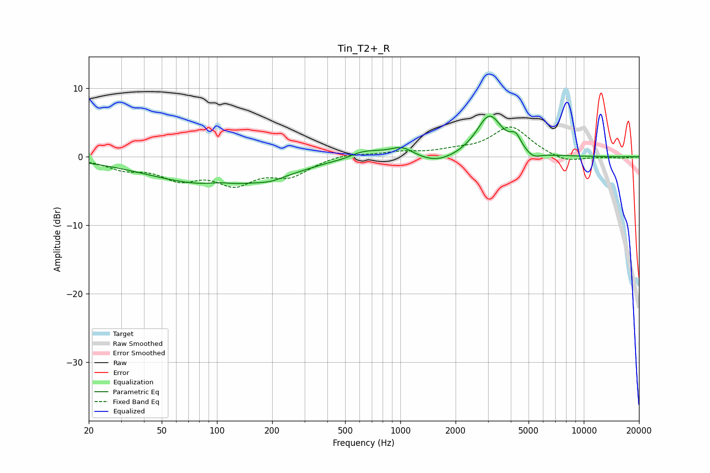

# Tin_T2+_R
See [usage instructions](https://github.com/jaakkopasanen/AutoEq#usage) for more options and info.

### Parametric EQs
Apply preamp of -6.0 dB when using parametric equalizer.

|   # | Type    |   Fc (Hz) |    Q |   Gain (dB) |
|-----|---------|-----------|------|-------------|
|   1 | Peaking |       103 | 0.38 |        -4.2 |
|   2 | Peaking |       103 | 2.15 |         0.4 |
|   3 | Peaking |       198 | 2.23 |        -0.4 |
|   4 | Peaking |       499 | 2.58 |        -0.3 |
|   5 | Peaking |       618 | 1.18 |         1.5 |
|   6 | Peaking |      1023 | 2.3  |         1.3 |
|   7 | Peaking |      1586 | 1.35 |        -1.2 |
|   8 | Peaking |      3059 | 2.01 |         6   |
|   9 | Peaking |      4255 | 4.78 |         1.8 |
|  10 | Peaking |      5289 | 3.35 |        -0.9 |

### Fixed Band EQs
When using fixed band (also called graphic) equalizer, apply preamp of **-4.4 dB** (if available) and set gains manually with these parameters.

|   # | Type    |   Fc (Hz) |    Q |   Gain (dB) |
|-----|---------|-----------|------|-------------|
|   1 | Peaking |        31 | 1.41 |        -1.5 |
|   2 | Peaking |        62 | 1.41 |        -2.8 |
|   3 | Peaking |       125 | 1.41 |        -3.5 |
|   4 | Peaking |       250 | 1.41 |        -2.5 |
|   5 | Peaking |       500 | 1.41 |         0.5 |
|   6 | Peaking |      1000 | 1.41 |         0.6 |
|   7 | Peaking |      2000 | 1.41 |         0.7 |
|   8 | Peaking |      4000 | 1.41 |         4.3 |
|   9 | Peaking |      8000 | 1.41 |        -1   |
|  10 | Peaking |     16000 | 1.41 |        -0.2 |

### Graphs

