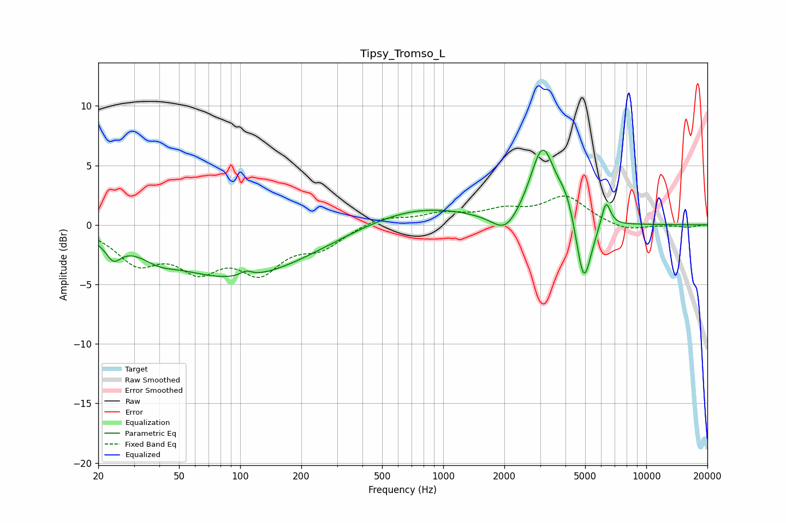

# Tipsy_Tromso_L
See [usage instructions](https://github.com/jaakkopasanen/AutoEq#usage) for more options and info.

### Parametric EQs
Apply preamp of -6.4 dB when using parametric equalizer.

|   # | Type    |   Fc (Hz) |    Q |   Gain (dB) |
|-----|---------|-----------|------|-------------|
|   1 | Peaking |        24 | 3.81 |        -1.5 |
|   2 | Peaking |        40 | 1.96 |        -0.7 |
|   3 | Peaking |        96 | 0.38 |        -4.4 |
|   4 | Peaking |       107 | 5.06 |         0.5 |
|   5 | Peaking |       753 | 0.54 |         1.6 |
|   6 | Peaking |      2028 | 2.15 |        -1.8 |
|   7 | Peaking |      3087 | 2.29 |         6.4 |
|   8 | Peaking |      4065 | 3.13 |         1.8 |
|   9 | Peaking |      4919 | 3.65 |        -5.9 |
|  10 | Peaking |      6333 | 6    |         2.2 |

### Fixed Band EQs
When using fixed band (also called graphic) equalizer, apply preamp of **-2.5 dB** (if available) and set gains manually with these parameters.

|   # | Type    |   Fc (Hz) |    Q |   Gain (dB) |
|-----|---------|-----------|------|-------------|
|   1 | Peaking |        31 | 1.41 |        -2.9 |
|   2 | Peaking |        62 | 1.41 |        -3.1 |
|   3 | Peaking |       125 | 1.41 |        -3.5 |
|   4 | Peaking |       250 | 1.41 |        -1.6 |
|   5 | Peaking |       500 | 1.41 |         0.7 |
|   6 | Peaking |      1000 | 1.41 |         0.8 |
|   7 | Peaking |      2000 | 1.41 |         1   |
|   8 | Peaking |      4000 | 1.41 |         2.3 |
|   9 | Peaking |      8000 | 1.41 |        -0.6 |
|  10 | Peaking |     16000 | 1.41 |        -0.2 |

### Graphs

