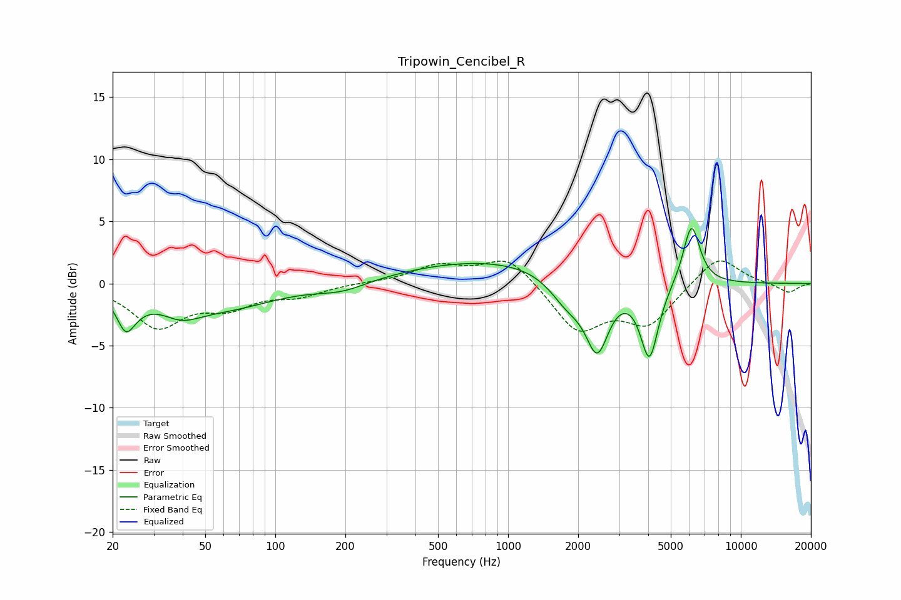

# Tripowin_Cencibel_R
See [usage instructions](https://github.com/jaakkopasanen/AutoEq#usage) for more options and info.

### Parametric EQs
Apply preamp of -4.5 dB when using parametric equalizer.

|   # | Type    |   Fc (Hz) |    Q |   Gain (dB) |
|-----|---------|-----------|------|-------------|
|   1 | Peaking |        23 | 3.9  |        -2.3 |
|   2 | Peaking |        25 | 2.38 |        -0.7 |
|   3 | Peaking |        39 | 1.64 |        -1.4 |
|   4 | Peaking |        60 | 0.65 |        -1.8 |
|   5 | Peaking |       194 | 1.27 |        -0.7 |
|   6 | Peaking |       880 | 0.36 |         1.9 |
|   7 | Peaking |      1798 | 1.83 |        -2.2 |
|   8 | Peaking |      2416 | 2.8  |        -5.4 |
|   9 | Peaking |      4049 | 3.61 |        -6.1 |
|  10 | Peaking |      6136 | 3.82 |         4.9 |

### Fixed Band EQs
When using fixed band (also called graphic) equalizer, apply preamp of **-1.9 dB** (if available) and set gains manually with these parameters.

|   # | Type    |   Fc (Hz) |    Q |   Gain (dB) |
|-----|---------|-----------|------|-------------|
|   1 | Peaking |        31 | 1.41 |        -3.4 |
|   2 | Peaking |        62 | 1.41 |        -1.6 |
|   3 | Peaking |       125 | 1.41 |        -0.9 |
|   4 | Peaking |       250 | 1.41 |         0.1 |
|   5 | Peaking |       500 | 1.41 |         1.4 |
|   6 | Peaking |      1000 | 1.41 |         2.2 |
|   7 | Peaking |      2000 | 1.41 |        -3.8 |
|   8 | Peaking |      4000 | 1.41 |        -3.1 |
|   9 | Peaking |      8000 | 1.41 |         2.4 |
|  10 | Peaking |     16000 | 1.41 |        -0.8 |

### Graphs

