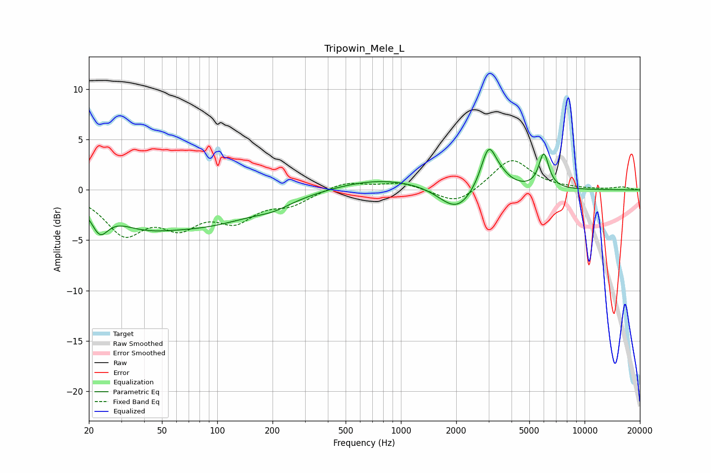

# Tripowin_Mele_L
See [usage instructions](https://github.com/jaakkopasanen/AutoEq#usage) for more options and info.

### Parametric EQs
Apply preamp of -4.1 dB when using parametric equalizer.

|   # | Type    |   Fc (Hz) |    Q |   Gain (dB) |
|-----|---------|-----------|------|-------------|
|   1 | Peaking |        23 | 3.1  |        -2.5 |
|   2 | Peaking |        38 | 0.91 |        -1.5 |
|   3 | Peaking |        80 | 0.43 |        -3.3 |
|   4 | Peaking |       204 | 1.59 |        -0.5 |
|   5 | Peaking |       775 | 0.54 |         1.2 |
|   6 | Peaking |      1817 | 1.64 |        -0.6 |
|   7 | Peaking |      2061 | 1.66 |        -1.9 |
|   8 | Peaking |      2999 | 3.4  |         4.1 |
|   9 | Peaking |      3493 | 2.5  |         0.8 |
|  10 | Peaking |      5996 | 5.13 |         3.4 |

### Fixed Band EQs
When using fixed band (also called graphic) equalizer, apply preamp of **-3.0 dB** (if available) and set gains manually with these parameters.

|   # | Type    |   Fc (Hz) |    Q |   Gain (dB) |
|-----|---------|-----------|------|-------------|
|   1 | Peaking |        31 | 1.41 |        -4   |
|   2 | Peaking |        62 | 1.41 |        -3   |
|   3 | Peaking |       125 | 1.41 |        -2.6 |
|   4 | Peaking |       250 | 1.41 |        -1.3 |
|   5 | Peaking |       500 | 1.41 |         0.8 |
|   6 | Peaking |      1000 | 1.41 |         0.7 |
|   7 | Peaking |      2000 | 1.41 |        -1.5 |
|   8 | Peaking |      4000 | 1.41 |         3.1 |
|   9 | Peaking |      8000 | 1.41 |         0.1 |
|  10 | Peaking |     16000 | 1.41 |         0.3 |

### Graphs

