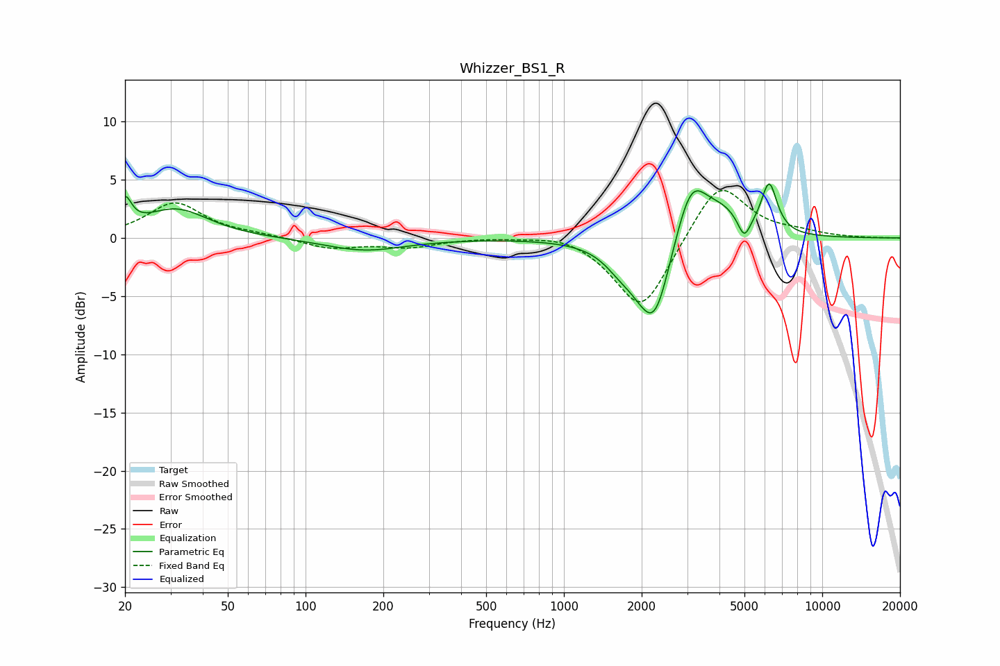

# Whizzer_BS1_R
See [usage instructions](https://github.com/jaakkopasanen/AutoEq#usage) for more options and info.

### Parametric EQs
Apply preamp of -4.7 dB when using parametric equalizer.

|   # | Type    |   Fc (Hz) |    Q |   Gain (dB) |
|-----|---------|-----------|------|-------------|
|   1 | Peaking |        20 | 5.77 |         2.4 |
|   2 | Peaking |        32 | 1.14 |         2.5 |
|   3 | Peaking |       169 | 0.9  |        -1.1 |
|   4 | Peaking |      1615 | 2.58 |        -0.7 |
|   5 | Peaking |      1948 | 1.61 |        -2.1 |
|   6 | Peaking |      2253 | 2.24 |        -6.4 |
|   7 | Peaking |      3107 | 2.1  |         5.7 |
|   8 | Peaking |      4150 | 2.05 |         1.6 |
|   9 | Peaking |      4988 | 6    |        -1.8 |
|  10 | Peaking |      6231 | 4.48 |         4.3 |

### Fixed Band EQs
When using fixed band (also called graphic) equalizer, apply preamp of **-4.2 dB** (if available) and set gains manually with these parameters.

|   # | Type    |   Fc (Hz) |    Q |   Gain (dB) |
|-----|---------|-----------|------|-------------|
|   1 | Peaking |        31 | 1.41 |         3   |
|   2 | Peaking |        62 | 1.41 |         0.2 |
|   3 | Peaking |       125 | 1.41 |        -0.9 |
|   4 | Peaking |       250 | 1.41 |        -0.7 |
|   5 | Peaking |       500 | 1.41 |         0.1 |
|   6 | Peaking |      1000 | 1.41 |         0.6 |
|   7 | Peaking |      2000 | 1.41 |        -6.5 |
|   8 | Peaking |      4000 | 1.41 |         5.1 |
|   9 | Peaking |      8000 | 1.41 |         0.4 |
|  10 | Peaking |     16000 | 1.41 |        -0   |

### Graphs

