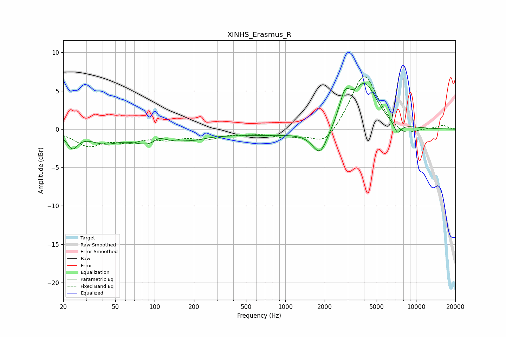

# XINHS_Erasmus_R
See [usage instructions](https://github.com/jaakkopasanen/AutoEq#usage) for more options and info.

### Parametric EQs
Apply preamp of -6.1 dB when using parametric equalizer.

|   # | Type    |   Fc (Hz) |    Q |   Gain (dB) |
|-----|---------|-----------|------|-------------|
|   1 | Peaking |        23 | 3.42 |        -2   |
|   2 | Peaking |        41 | 1.26 |        -1.4 |
|   3 | Peaking |        96 | 1.07 |        -1.8 |
|   4 | Peaking |       108 | 2.99 |         1   |
|   5 | Peaking |       203 | 1.84 |        -0.5 |
|   6 | Peaking |       700 | 0.21 |        -0.8 |
|   7 | Peaking |      1842 | 2.49 |        -3.2 |
|   8 | Peaking |      2855 | 3.23 |         3.5 |
|   9 | Peaking |      4062 | 1.51 |         5.9 |
|  10 | Peaking |      7223 | 4.6  |        -1.5 |

### Fixed Band EQs
When using fixed band (also called graphic) equalizer, apply preamp of **-6.9 dB** (if available) and set gains manually with these parameters.

|   # | Type    |   Fc (Hz) |    Q |   Gain (dB) |
|-----|---------|-----------|------|-------------|
|   1 | Peaking |        31 | 1.41 |        -2   |
|   2 | Peaking |        62 | 1.41 |        -1.3 |
|   3 | Peaking |       125 | 1.41 |        -1   |
|   4 | Peaking |       250 | 1.41 |        -1.1 |
|   5 | Peaking |       500 | 1.41 |        -0.3 |
|   6 | Peaking |      1000 | 1.41 |        -0.9 |
|   7 | Peaking |      2000 | 1.41 |        -2.3 |
|   8 | Peaking |      4000 | 1.41 |         7.5 |
|   9 | Peaking |      8000 | 1.41 |        -1.4 |
|  10 | Peaking |     16000 | 1.41 |         0.5 |

### Graphs

