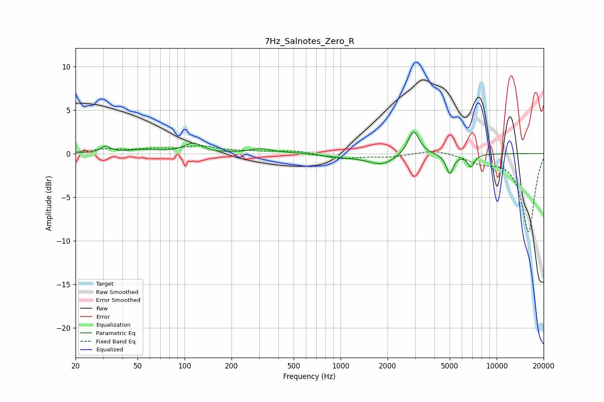

# 7Hz_Salnotes_Zero_R
See [usage instructions](https://github.com/jaakkopasanen/AutoEq#usage) for more options and info.

### Parametric EQs
Apply preamp of -2.6 dB when using parametric equalizer.

|   # | Type    |   Fc (Hz) |    Q |   Gain (dB) |
|-----|---------|-----------|------|-------------|
|   1 | Peaking |        31 | 4.65 |         0.7 |
|   2 | Peaking |        54 | 1.41 |         0.4 |
|   3 | Peaking |       114 | 2.47 |         1.1 |
|   4 | Peaking |       306 | 2.02 |         0.5 |
|   5 | Peaking |       526 | 1.14 |         0.2 |
|   6 | Peaking |      1019 | 0.86 |        -0.3 |
|   7 | Peaking |      1842 | 1.61 |        -1.2 |
|   8 | Peaking |      2935 | 3.81 |         2.9 |
|   9 | Peaking |      5009 | 5.97 |        -2.3 |
|  10 | Peaking |      6854 | 5.97 |        -1.4 |

### Fixed Band EQs
When using fixed band (also called graphic) equalizer, apply preamp of **-1.0 dB** (if available) and set gains manually with these parameters.

|   # | Type    |   Fc (Hz) |    Q |   Gain (dB) |
|-----|---------|-----------|------|-------------|
|   1 | Peaking |        31 | 1.41 |         0.4 |
|   2 | Peaking |        62 | 1.41 |         0.4 |
|   3 | Peaking |       125 | 1.41 |         0.8 |
|   4 | Peaking |       250 | 1.41 |         0.2 |
|   5 | Peaking |       500 | 1.41 |         0.3 |
|   6 | Peaking |      1000 | 1.41 |        -0.6 |
|   7 | Peaking |      2000 | 1.41 |        -0.4 |
|   8 | Peaking |      4000 | 1.41 |         0.5 |
|   9 | Peaking |      8000 | 1.41 |        -0.9 |
|  10 | Peaking |     16000 | 1.41 |        -9   |

### Graphs

