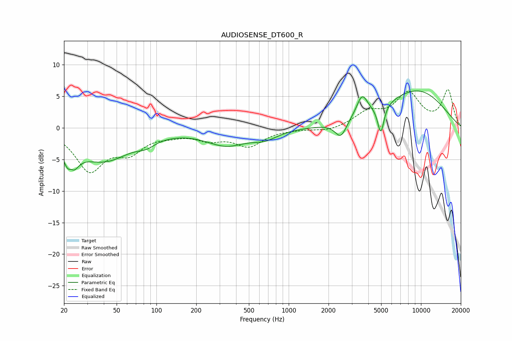

# AUDIOSENSE_DT600_R
See [usage instructions](https://github.com/jaakkopasanen/AutoEq#usage) for more options and info.

### Parametric EQs
Apply preamp of -6.0 dB when using parametric equalizer.

|   # | Type    |   Fc (Hz) |    Q |   Gain (dB) |
|-----|---------|-----------|------|-------------|
|   1 | Peaking |        22 | 3.59 |        -6.7 |
|   2 | Peaking |        23 | 5.94 |         3.1 |
|   3 | Peaking |        40 | 0.68 |        -5   |
|   4 | Peaking |        84 | 2.17 |        -0.9 |
|   5 | Peaking |       337 | 0.92 |        -2.5 |
|   6 | Peaking |       662 | 1.47 |        -1.2 |
|   7 | Peaking |      2477 | 3.25 |        -2.6 |
|   8 | Peaking |      3584 | 3.36 |         3.3 |
|   9 | Peaking |      4969 | 5.84 |        -4.5 |
|  10 | Peaking |      9213 | 0.49 |         5.9 |

### Fixed Band EQs
When using fixed band (also called graphic) equalizer, apply preamp of **-6.2 dB** (if available) and set gains manually with these parameters.

|   # | Type    |   Fc (Hz) |    Q |   Gain (dB) |
|-----|---------|-----------|------|-------------|
|   1 | Peaking |        31 | 1.41 |        -6.5 |
|   2 | Peaking |        62 | 1.41 |        -3.2 |
|   3 | Peaking |       125 | 1.41 |        -0.7 |
|   4 | Peaking |       250 | 1.41 |        -1.5 |
|   5 | Peaking |       500 | 1.41 |        -2.7 |
|   6 | Peaking |      1000 | 1.41 |        -0.1 |
|   7 | Peaking |      2000 | 1.41 |        -0.6 |
|   8 | Peaking |      4000 | 1.41 |         2.3 |
|   9 | Peaking |      8000 | 1.41 |         5.2 |
|  10 | Peaking |     16000 | 1.41 |         5.8 |

### Graphs

