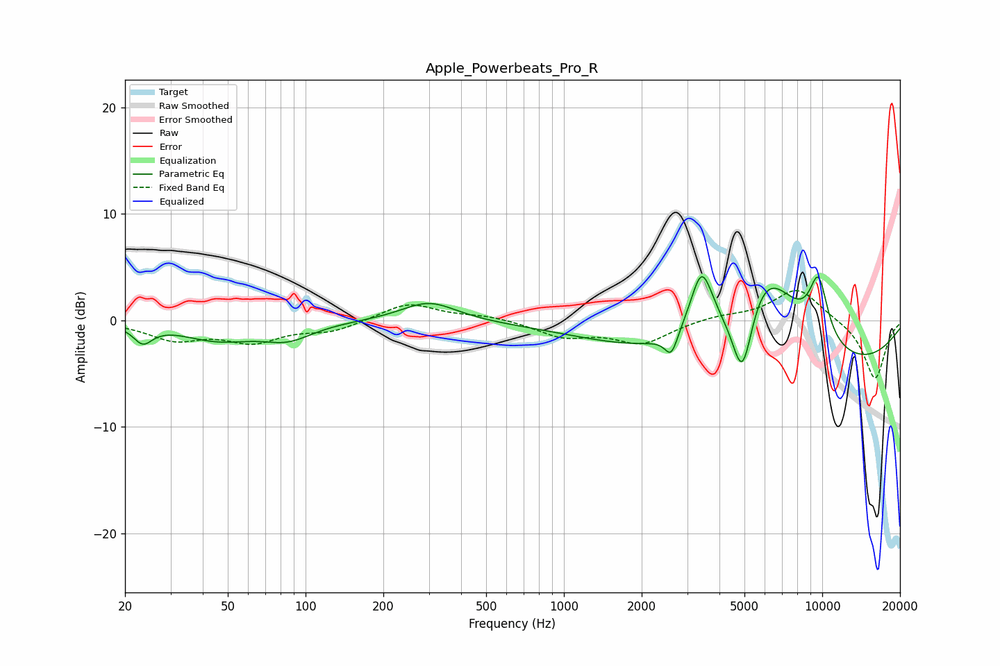

# Apple_Powerbeats_Pro_R
See [usage instructions](https://github.com/jaakkopasanen/AutoEq#usage) for more options and info.

### Parametric EQs
Apply preamp of -4.2 dB when using parametric equalizer.

|   # | Type    |   Fc (Hz) |    Q |   Gain (dB) |
|-----|---------|-----------|------|-------------|
|   1 | Peaking |        23 | 3.9  |        -1.6 |
|   2 | Peaking |        46 | 1.01 |        -1.7 |
|   3 | Peaking |        85 | 1.45 |        -1.5 |
|   4 | Peaking |       301 | 1.33 |         1.9 |
|   5 | Peaking |      2605 | 5.74 |        -2.1 |
|   6 | Peaking |      3411 | 3.2  |         6   |
|   7 | Peaking |      4907 | 3.24 |        -8   |
|   8 | Peaking |      5882 | 0.93 |        10.3 |
|   9 | Peaking |      7024 | 0.2  |        -5.9 |
|  10 | Peaking |      9674 | 3.38 |         5.7 |

### Fixed Band EQs
When using fixed band (also called graphic) equalizer, apply preamp of **-2.9 dB** (if available) and set gains manually with these parameters.

|   # | Type    |   Fc (Hz) |    Q |   Gain (dB) |
|-----|---------|-----------|------|-------------|
|   1 | Peaking |        31 | 1.41 |        -1.7 |
|   2 | Peaking |        62 | 1.41 |        -1.8 |
|   3 | Peaking |       125 | 1.41 |        -1   |
|   4 | Peaking |       250 | 1.41 |         1.7 |
|   5 | Peaking |       500 | 1.41 |         0.4 |
|   6 | Peaking |      1000 | 1.41 |        -1.4 |
|   7 | Peaking |      2000 | 1.41 |        -2.1 |
|   8 | Peaking |      4000 | 1.41 |         0.4 |
|   9 | Peaking |      8000 | 1.41 |         3.1 |
|  10 | Peaking |     16000 | 1.41 |        -5.6 |

### Graphs

