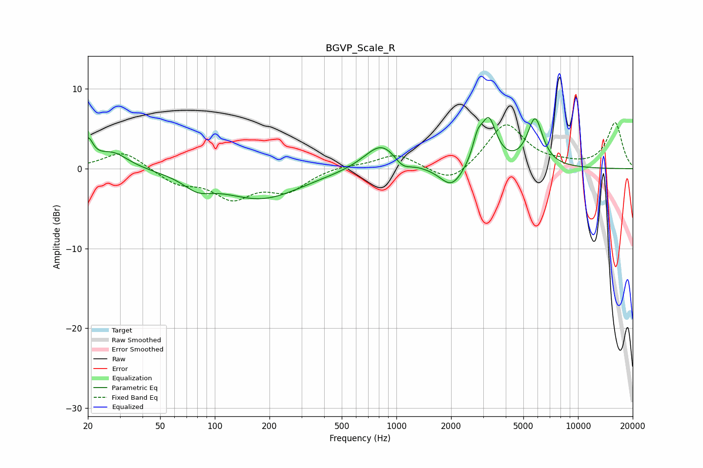

# BGVP_Scale_R
See [usage instructions](https://github.com/jaakkopasanen/AutoEq#usage) for more options and info.

### Parametric EQs
Apply preamp of -6.5 dB when using parametric equalizer.

|   # | Type    |   Fc (Hz) |    Q |   Gain (dB) |
|-----|---------|-----------|------|-------------|
|   1 | Peaking |        20 | 5.23 |         3   |
|   2 | Peaking |        27 | 1.61 |         2.1 |
|   3 | Peaking |        81 | 1.82 |        -1.5 |
|   4 | Peaking |       180 | 0.64 |        -3.7 |
|   5 | Peaking |       830 | 1.5  |         3.4 |
|   6 | Peaking |      1078 | 3.08 |        -1.2 |
|   7 | Peaking |      2013 | 2.21 |        -2.7 |
|   8 | Peaking |      2795 | 5.29 |         2.5 |
|   9 | Peaking |      3225 | 3.3  |         5.8 |
|  10 | Peaking |      5801 | 3.22 |         6   |

### Fixed Band EQs
When using fixed band (also called graphic) equalizer, apply preamp of **-5.9 dB** (if available) and set gains manually with these parameters.

|   # | Type    |   Fc (Hz) |    Q |   Gain (dB) |
|-----|---------|-----------|------|-------------|
|   1 | Peaking |        31 | 1.41 |         2.3 |
|   2 | Peaking |        62 | 1.41 |        -1.7 |
|   3 | Peaking |       125 | 1.41 |        -3.4 |
|   4 | Peaking |       250 | 1.41 |        -2.6 |
|   5 | Peaking |       500 | 1.41 |         0.4 |
|   6 | Peaking |      1000 | 1.41 |         1.8 |
|   7 | Peaking |      2000 | 1.41 |        -2.1 |
|   8 | Peaking |      4000 | 1.41 |         5.7 |
|   9 | Peaking |      8000 | 1.41 |         0.4 |
|  10 | Peaking |     16000 | 1.41 |         5.7 |

### Graphs

