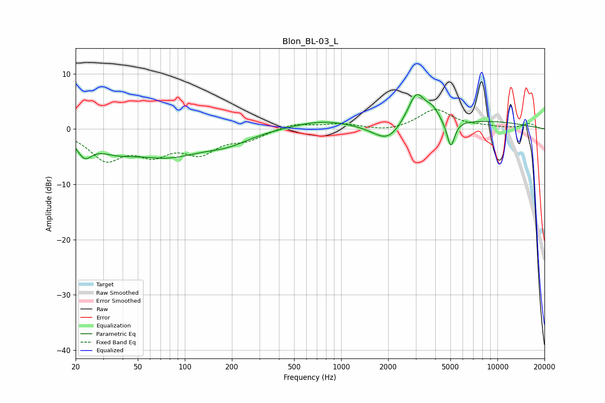

# Blon_BL-03_L
See [usage instructions](https://github.com/jaakkopasanen/AutoEq#usage) for more options and info.

### Parametric EQs
Apply preamp of -6.3 dB when using parametric equalizer.

|   # | Type    |   Fc (Hz) |    Q |   Gain (dB) |
|-----|---------|-----------|------|-------------|
|   1 | Peaking |        23 | 3.04 |        -3.2 |
|   2 | Peaking |        35 | 1.11 |        -2.2 |
|   3 | Peaking |        77 | 0.6  |        -4.5 |
|   4 | Peaking |       190 | 1.01 |        -1.6 |
|   5 | Peaking |       759 | 0.72 |         1.6 |
|   6 | Peaking |      1978 | 1.61 |        -3   |
|   7 | Peaking |      3030 | 2.43 |         6.1 |
|   8 | Peaking |      3857 | 3.5  |         1.8 |
|   9 | Peaking |      5028 | 5.63 |        -4.9 |
|  10 | Peaking |      8333 | 0.42 |         1.3 |

### Fixed Band EQs
When using fixed band (also called graphic) equalizer, apply preamp of **-3.6 dB** (if available) and set gains manually with these parameters.

|   # | Type    |   Fc (Hz) |    Q |   Gain (dB) |
|-----|---------|-----------|------|-------------|
|   1 | Peaking |        31 | 1.41 |        -5.1 |
|   2 | Peaking |        62 | 1.41 |        -3.8 |
|   3 | Peaking |       125 | 1.41 |        -3.8 |
|   4 | Peaking |       250 | 1.41 |        -1.6 |
|   5 | Peaking |       500 | 1.41 |         1   |
|   6 | Peaking |      1000 | 1.41 |         0.9 |
|   7 | Peaking |      2000 | 1.41 |        -0.5 |
|   8 | Peaking |      4000 | 1.41 |         3.5 |
|   9 | Peaking |      8000 | 1.41 |         0.4 |
|  10 | Peaking |     16000 | 1.41 |         0.9 |

### Graphs

