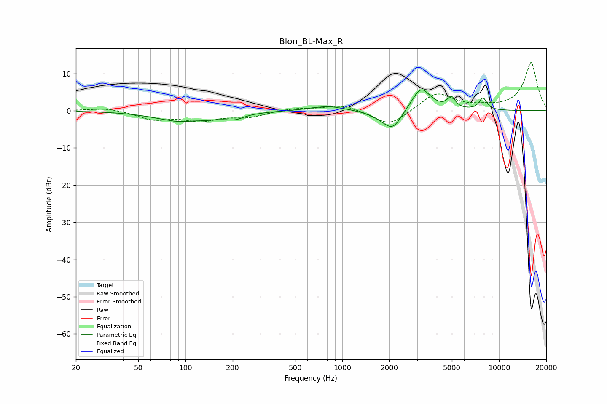

# Blon_BL-Max_R
See [usage instructions](https://github.com/jaakkopasanen/AutoEq#usage) for more options and info.

### Parametric EQs
Apply preamp of -5.7 dB when using parametric equalizer.

|   # | Type    |   Fc (Hz) |    Q |   Gain (dB) |
|-----|---------|-----------|------|-------------|
|   1 | Peaking |       103 | 0.8  |        -3.2 |
|   2 | Peaking |       111 | 2.52 |         0.5 |
|   3 | Peaking |       207 | 2.57 |        -1.2 |
|   4 | Peaking |       769 | 1.23 |         1   |
|   5 | Peaking |       873 | 1.66 |         0.4 |
|   6 | Peaking |      1844 | 1.9  |        -1.4 |
|   7 | Peaking |      2114 | 2.48 |        -4.5 |
|   8 | Peaking |      3172 | 2.32 |         6.5 |
|   9 | Peaking |      4956 | 5.77 |         2.9 |
|  10 | Peaking |      7889 | 5.41 |         3.2 |

### Fixed Band EQs
When using fixed band (also called graphic) equalizer, apply preamp of **-13.0 dB** (if available) and set gains manually with these parameters.

|   # | Type    |   Fc (Hz) |    Q |   Gain (dB) |
|-----|---------|-----------|------|-------------|
|   1 | Peaking |        31 | 1.41 |         0.9 |
|   2 | Peaking |        62 | 1.41 |        -2.2 |
|   3 | Peaking |       125 | 1.41 |        -2.4 |
|   4 | Peaking |       250 | 1.41 |        -1.6 |
|   5 | Peaking |       500 | 1.41 |         0.7 |
|   6 | Peaking |      1000 | 1.41 |         1.7 |
|   7 | Peaking |      2000 | 1.41 |        -4.3 |
|   8 | Peaking |      4000 | 1.41 |         4.9 |
|   9 | Peaking |      8000 | 1.41 |         0.7 |
|  10 | Peaking |     16000 | 1.41 |        13   |

### Graphs

